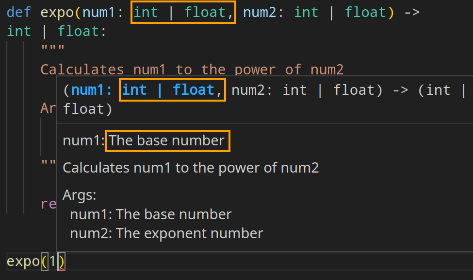

# Better dev exp

Here we will learn about function annotations, docstrings, and formatting styles.

## Function Annotation

- In Python 3 we can specify the type of our arguments and what our function returns.
- They're optional metadata info.

> [!NOTE]
>
> Though the main idea was introduced in [PEP 3107](https://peps.python.org/pep-3107/) and [PEP 484](https://peps.python.org/pep-0484/) but from version 3.5 onward we have a [typing](https://docs.python.org/3/library/typing.html#module-typing) section in the Python's doc. So be sure to read those PEPs and docs thoroughly since type-safety of your code, and its maintainability depends on it IMO.

```python
def place_order(
        product_id: int,
        quantity: int,
        /,
        discount_code: str=None,
        *,
        shipping_address: str,
        expedited: bool=False) -> None:
    pass
```

> [!TIP]
>
> You'll learn about modules [here](../03-modularity/modules.md), but just for now you just need to know that they are like a toolbox with prebuilt tools ready for you to use them. And in that toolbox we have a tool (module) called `typing`.
>
> `typing.Tuple` and `typing.List` are Generic types; this means you can specify what type their contents must be e.g. a list of integers:
>
> ```py
> import typing
> numbers: typing.List[int] = [1, 2]
> ```
>
> But from version 3.5 we do not need to use these generic types exported from `typing` module. But instead we can use the built-in types, i.e.:
>
> ```py
> numbers: list[int] = [3, 4]
> ```
>
> **What is important is to keep in mind that this is the new preferred way of type annotating stuff.**

## Docstring

- First line:
  - Always short.
  - Concise summary of the function's purpose.
  - Begin with a capital letter and end with a period.
- If it is multiline, second line should be blank.
- The 3rd line going forward you can write a description about your function. Things like:
  - Calling conventions.
  - Return value.
  - etc.

```python
def expo(num1: int | float, num2: int | float) -> int | float:
    """
    Calculates num1 to the power of num2

    Args:
      num1: The base number
      num2: The exponent number
    """

    return num1 ** num2
```

- Note that now when you are entering numbers it will show a small tooltip window telling yuo what is that argument.
  
- **DRY principle**: since I am annotating my arguments here (`: int | float`) I intentionally dropped it from docstring. It is just redundant and hard to maintain.
- Docstring in Python is supper flexible. E.g. you can rewrite this docstring like this too:

  ```py
  """
  Calculates num1 to the power of num2

  Arguments:
    num1: The base number
    num2: The exponent number
  """
  ```

  Or

  ```py
  """
  Calculates num1 to the power of num2

  :param num1: The base number
  :param num2: The exponent number
  """
  ```

  So pick one and stick to it. I mean consistency is a good thing to have when coding.

> [!TIP]
>
> You can learn how to write good docstring by going through [PEP 256](https://peps.python.org/pep-0256/), [PEP 257](https://peps.python.org/pep-0257/) and [PEP 0258](https://peps.python.org/pep-0258/).

## Formatting Styles

- Making your code more readable is always a good idea, and adopting a nice coding style can help that tremendously.
- [PEP 8](https://peps.python.org/pep-0008/) is our style guide as I mentioned it from time to time.

### Most Important Points Extracted from PEP 8

- Use docstrings.
- Use 4-space indentation, no tabs.
- Wrap lines so that they do **NOT** exceed 79 characters.
- Write comments in a separate line whenever possible.
- Use blank lines to separate functions, classes, and larger blocks of code inside functions.
- Spaces:

  - After commas.
  - Around operators.

  ```python
  result = max(1, 2) + max(3, 4)
  ```

- Consistent function/class naming:

  - Class: `PascalCase`.
  - Methods/functions: `snake_case`.

  We talked about naming conventions [here](../01-intro/README.md#namingConventions).

- `self` as the name for the first method argument (will discuss it when we learned classes in Python).
- Try to use plain English and not fancy characters or some chars that needs a different encoding than utf-8 (we talked about encoding [here](./whetting-your-appetite-and-basic-concepts.md#pythonSourceFilesEncoding)).

### VSCode Extensions

Here we'll go over some of the most useful extensions in VSCode for coding in Python.

<details>
<summary>autopep8</summary>

1. Open "Extensions", press `Ctrl+Shift+x` or click on its icon on the left hand side panel:

   

2. Search for "[autopep8](https://marketplace.visualstudio.com/items?itemName=ms-python.autopep8)" and click on install button.

   

3. Open "Settings" by pressing `Ctrl+comma` or clicking on the gear icon on the bottom left corner of VSCode:

   

4. Then search for "Format On Save" and check it:

   

5. Configure autopep8 to be your default code formatter. To do that we need to open command palette by pressing `Ctrl+Shift+p` and type "format document with":

   

6. Press enter and autopep8 should be your default formatter.

   

   If not click on the "Configure Default Formatter":

   

7. And we need to configure it to not cross 79 line length define by PEP 8:

   

   [You can learn how to do it step by step here](https://stackoverflow.com/a/74370180/8784518).

> [!CAUTION]
>
> This extension in my experience does not do a very good job. So be sure to read the PEP 8 just in case it was messing with your code.

</details>
<details>
<summary>Pylint</summary>

Nice suggestions to improve your code quality.

</details>

<details>
<summary>Mypy Type Checker</summary>

An extension so that when you have a nicely annotated code like this your VSCode shows you a squiggly red line under it, indicating that something is wrong there:

```py
var: list[int] = [1, '2', 3]
```

</details>

<details>
<summary>Flake8</summary>

An extension for showing errors in your code that are more of a syntactical issue. E.g. here it will draw a squiggly line under `bogus` since it is a valid type.

```py
def a(aaaaaaaaaaaaaaa: int, bbbbbbbbbbbbbb: bogus):
    pass
```

</details>

<details>
<summary>Pylance</summary>

An extension for showing intellisense. E.g. when you type `"a string"` and press dot it should show a complete list of all methods available in Python.

</details>

<details>
<summary>isort</summary>

An extension for sorting imports. We can also [configure it to do it on save](https://gist.github.com/cb109/47496649640c9c5f4287b06db7a7c197). To sort import you can open the command pallete (`ctrl+shift+p`) and type "organize imports".

</details>

## Auto Import

Open the settings (<code>ctrl+`</code>) and search for "auto import completions". Then check it.

## YouTube/Aparat

- [https://youtu.be/\_6kees89A-o](https://youtu.be/_6kees89A-o).
- [https://aparat.com/v/juno9oe](https://aparat.com/v/juno9oe).
- [https://youtu.be/dbAhyKVeqXs](https://youtu.be/dbAhyKVeqXs).
- [https://aparat.com/v/ncd5e0q](https://aparat.com/v/ncd5e0q).
