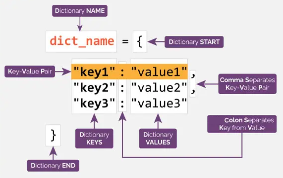

# [Dictionaries](https://docs.python.org/3.9/library/stdtypes.html#mapping-types-dict)

- Built-in data type.
- A set of key: value pairs.
  
- Indexed by keys.

  - They can be strings, numbers, tuples:

    ```py
    info = {
      "name": "Claudius Ptolemy",
      100: ["Mathematician", "Astrologist", "Geologist"],
      ("Alexandria", "Egypt", "Roman Empire"): "Alexandria is the second largest city in Egypt and the largest city on the Mediterranean coast."
    }
    ```

    > [!CAUTION]
    >
    > If a tuple contains any mutable object either directly or indirectly, it cannot be used as a key.

  - **They have to be unique** within one dictionary.

- You'll get an **error** if you try to extract a value using a **non-existent** key.
  ```py
  profile = {
    username: "Genghis_khan"
  }
  print(profile["age"])
  ```
- Get a list of keys like this:
  ```py
  info = {
      "name": "Claudius Ptolemy",
      "fields": ["Mathematician", "Astrologist", "Geologist"],
      "home_town": "Alexandria is the second largest city in Egypt and the largest city on the Mediterranean coast.",
      "died": 100
  }
  keys = list(info)
  sorted_keys = sorted(info)
  print(keys, sorted_keys)
  ```
- Use `del` to delete something:
  ```py
  me = {"test": 123}
  del me["test"]
  print(me) # {}
  ```
- We can use membership test operator, i.e. `in` too:
  ```py
  user = {"name": "Maya"}
  print("address" in user)
  ```
- Build dictionary directly from sequences of key-value pairs with the `dict()` constructor:
  ```py
  ai_figures = [("John McCarthy", 2011), ("Kate Crawford", None)]
  print(dict(ai_figures))
  # Yet another way:
  print(dict(key1="value1", key2="value2"))
  ```
- Dictionary comprehensions:
  ```py
  numbers = {number: "even" if number % 2 == 0 else "odd"
             for number in range(1, 100)}
  print(numbers)
  ```
