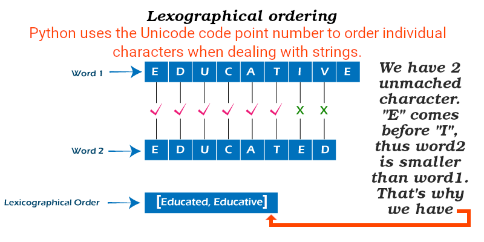
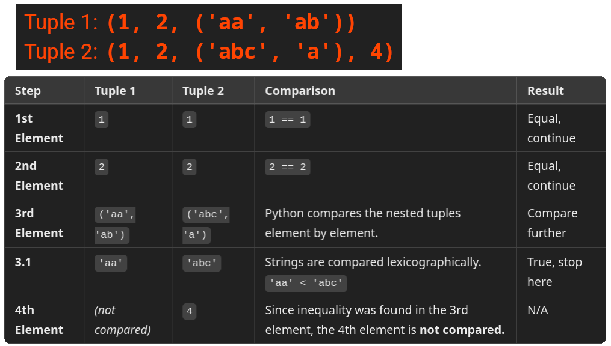

# Looping

- Retrieve key, and value of a dictionary in a loop at the same time:
  ```py
  large_language_models = {
      "llama": "Can do dialogue generation and language translation.",
      "gpt-4": "Accepts text, and images as input.",
  }
  for key, value in large_language_models.items():
      print(key.upper() + ": " + value)
  ```
- Get the index and value of a sequence at the same time:
  ```py
  predictive_text = ["Hi", "What's up", "Aha"]
  for index, text in enumerate(predictive_text):
      print(str(index) + ": " + text)
  ```
- Pair elements of two more more sequences with `zip`:
  ```py
  questions = [
      'What can I do when getting "We are no longer accepting questions/answers from this account"?',
      'How do I ask and answer homework questions?']
  answers = ["https://meta.stackoverflow.com/questions/255583",
             "https://meta.stackoverflow.com/questions/334822"]
  for question, answer in zip(questions, answers):
      print(question)
      print("\t", answer)
  ```
- Loop from the end to the start:
  ```py
  oil_prices = [70.10, 73.58,
                74.19, 3.946, 1.959]
  for price in reversed(oil_prices):
      print(price)
  ```
- Loop over a sorted list:
  ```py
  oil_prices = [70.10, 73.58,
                74.19, 3.946, 1.959]
  for price in sorted(oil_prices):
      print(price)
  ```
- Idiomatic way to loop over unique elements of a sorted sequence:
  ```py
  groceries = ['apple', 'orange', 'apple', 'pear', 'orange', 'banana']
  for grocery in sorted(set(groceries)):
      print(grocery)
  ```
- Create a new list instead of modifying the one that you're looping over it:
  ```py
  years = [7010, 7358, 7419, 3946, 1959]
  stone_eras = [year for year in years if year < 5000]
  print(stone_eras)
  ```

# Conditions

- We can use any operator in `while` and `if`. E.g.:
  - [Membership test operators](https://docs.python.org/3/reference/expressions.html#membership-test-operations): `in`, or `not in`.
  - [Object identity checkers](https://docs.python.org/3/library/operator.html#operator.is_): `is`, and `is not`.
- Chain comparisons: `a < b == c` tests whether `a` is less than `b` and moreover `b` equals `c`.
- We can negated the result of an expression with `not`.
- Boolean operators:
  - `and`, `or`.
  - AKA short-circuit operators.
  - **Evaluated from left to right**.
    - **Evaluation stops as soon as the outcome is determined**.
    - E.g. if `A` and `C` are true but `B` is false, `A and B and C` does not evaluate the expression `C`.
  - Return value of a short-circuit operator is the last evaluated argument. E.g.:
    ```py
    string1, string2, string3 = '', 'Trondheim', 'Hammer Dance'
    non_null = string1 or string2 or string3
    print(non_null)
    ```
- Use Walrus operator to combine comparison and assignment in one expression:
  <table>
  <thead>
  <tr>
  <th>Normal</th>
  <th>Walrus</th>
  </tr>
  </thead>
  <tbody>
  <tr>
  <td>
  <pre lang="python">
  <code>
  numbers = [1, 2, 3, 4]
  for num in numbers:
      square = num * num
      if square > 5:
          print(square)
  </code>
  </pre>
  </td>
  <td>
  <pre lang="python">
  <code>
  numbers = [1, 2, 3, 4]
  for num in numbers:
      if (square := num * num) > 5:
          print(square)
  </code>
  </pre>
  Or a bit more Pythonic way of coding :wink::
  <pre lang="python">
  <code>
  numbers = [1, 2, 3, 4]
  squares = [square for num in numbers if (square := num * num) > 5]
  print(squares)
  </code>
  </pre>
  Not related to Walrus operator but just to show how powerful Python really is:
  <pre lang="python">
  <code>
  numbers = [1, 2, 3, 4]
  squares = [result for result in [num * num for num in numbers] if result > 5]
  print(squares)
  </code>
  </pre>
  </td>
  </tr>
  </tbody>
  </table>

# Comparing Sequence Types

- Uses _lexicographical_ ordering:

  1. The first two items are compared, if they differ this determines the outcome of the comparison. End!
  2. If they are equal, the next two items are compared, and so on, until either sequence is exhausted.

  

  ```py
  word1 = "EDUCATIVE"
  word2 = "EDUCATED"
  print(word1 < word2)
  print(sorted([word1, word2]))
  ```

- If two items to be compared are themselves sequences of the same type, the lexicographical comparison is carried out recursively.

  

  ```py
  tuple1 = (1, 2, ('aa', 'ab'))
  tuple2 = (1, 2, ('abc', 'a'), 4)
  print(tuple1 < tuple2) # True
  ```

- You can compare objects of different type **IF** they have appropriate comparison methods, e.g. 0 is equal to 0.0.
  ```py
  [1.0, 2, 4] == [1, 2, 4]
  ```

## <a title="codewars" href="https://www.codewars.com/"></a>

**Practice every day!**


## YouTube/Aparat

- [https://youtu.be/1Kr4_RsNJpk](https://youtu.be/1Kr4_RsNJpk).
- [https://aparat.com/v/fjau1g8](https://aparat.com/v/fjau1g8).

## Ref

- [5. Data Structures](https://docs.python.org/3/tutorial/datastructures.html).
