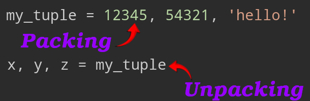

# Sequences

- Lists and strings have many common properties. E.g. indexing and slicing, etc. They're in fact _sequence data types_.
- Indexed by a range of numbers, e.g.:
  ```py
  nums = [1, 2]
  nums[0]
  ```

## [Tuples](https://docs.python.org/3.9/library/stdtypes.html#tuples)

- Another sequence data type.
- **Heterogeneous** sequence of elements, i.e. a number of values separated by commas:
  ```python
  my_tuple = 12345, 54321, 'hello!'
  ```
- Nested tuples:
  ```python
  some_tuple = 123, my_tuple, 456
  ```
- **Tuples are immutable**:
  ```python
  t = 1, 2
  t[0] = 313
  ```
- You can store mutable objects in a tuple:
  ```py
  messages = ({"content": "some msg", "created_at": "2024-12-27T08:05:11.948Z"},)
  messages[0]["content"] = "I am a new content"
  ```
- Tuples can be enclosed in parentheses. But sometimes they're necessary, e.g. in nested tuples we need them so that nested tuples are interpreted correctly.
- Similar to lists, but often used in different situations and for different purposes.
- Can access it via unpacking or indexing.

> [!TIP]
>
> - Empty tuples are constructed by an empty pair of parentheses.
> - Tuple with one item is constructed by following a value with a comma.

### Unpacking & Packing



> [!NOTE]
>
> - Works for any sequence on the right-hand side.
> - There should as many variables on the left side of the equals sign as there are elements in the sequence.

## [Sets](https://docs.python.org/3.9/library/stdtypes.html#set-types-set-frozenset)

- An unordered collection with no duplicate elements.
- Can be created via curly braces, or `set` built-in function.`
  ```py
  my_set = set('asdadasdasdasd')
  print(my_set)
  ```
- Common use cases: membership testing and eliminating duplicate entries.
  ```py
  names = {"Hinata", "Alex", "Alex", "Yu", "Kim"}
  if "Mohammad" in names:
      print("My name is there too")
  if "Mohammad" not in names:
      names.add("Mohammad")
  ```
- Support mathematical operations like union, intersection, difference, and symmetric difference.
  ```py
  a = {"a", "b", "c"}
  b = {"c", "d", "e"}
  # In just "a"
  print(a - b) # {'b', 'a'}
  # In "a" or "b"
  print(a | b) # {'d', 'b', 'a', 'c', 'e'}
  # In "a" or "b" but not both
  print(a ^ b) # {'a', 'd', 'b', 'e'}
  ```
- We have set comprehensions similar to [list comprehensions](./list-data-structure.md#list-comprehensions).
  ```py
  unique_numbers = set([1, 2, 3, 4, 5, 6, 7])
  even_numbers = {num for num in unique_numbers if num % 2 == 0}
  print(even_numbers)
  ```
