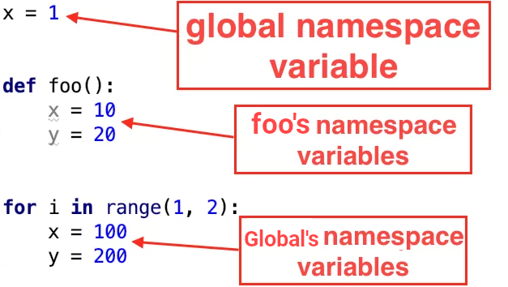
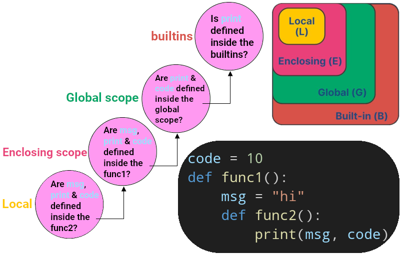
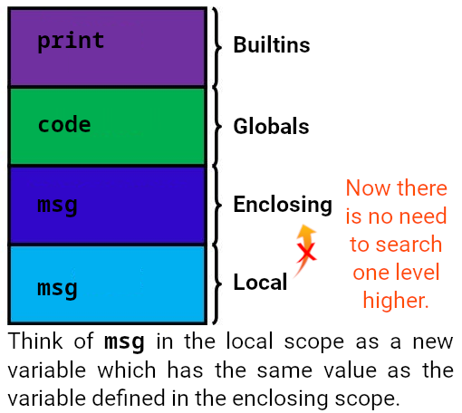
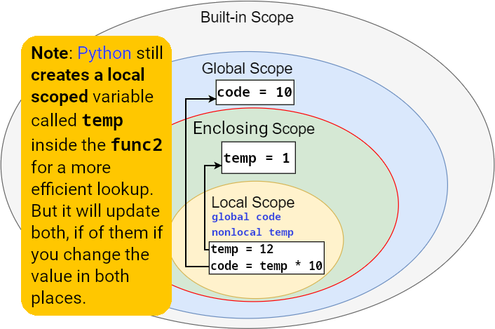
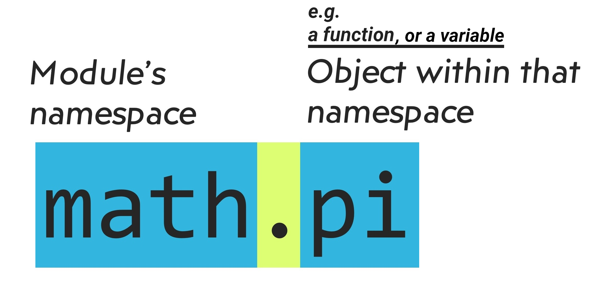

# Modules

Close Python interpreter and enter it again, the definitions you have made (functions and variables) are lost.That leads us to writing our code in a file and passing it to the Python interpreter as an input. AKA creating/writing a _script_.

- **Module**: Python codes written in a file.
  - Anything written in a Python file can be imported into another _module_.
- So when our program growth, we can split it into several files for:
  1. Easier maintenance.
  2. Reusability: a function is defined in one file and can be used in several programs.

```py
import turtle

turtle.pendown()
turtle.speed("fast")


def square(length: int) -> None:
    """Draw a square"""
    for side in range(0, 4):
        turtle.forward(length)
        turtle.right(90)

def diamond(length: int) -> None:
    """Draw a diamond"""
    turtle.left(45)
    turtle.forward(length / 1.4)
    for _ in range(3):
        turtle.right(90)
        turtle.forward(length * 1.4)
    turtle.right(90)
    turtle.forward(length / 1.4)


def shape1():
    for _ in range(72):
        square(100)
        turtle.left(5)

def enclosed_square_with_diamond(length: int) -> None:
    square(length)
    diamond(length)


enclosed_square_with_diamond(100)
# shape1()

turtle.done()
```

Virtually everything that your Python program creates or acts on is an object. **But** the question is how does Python keep track of all these names so that they don't interfere with one another?

## Scopes

- Classes, functions & modules create scope.
- Where something exists.
- Where we can use an object.

## Namespace

- The **structures** used to **organize** the symbolic **names assigned to objects**.
- Think of them as baskets with different things in it. You can have two pair of black socks in different baskets without interfering with each other, right?



> [!NOTE]
>
> **`dir` function**:
>
> - Returns a list of objects inside the module passed to it.
>   ```py
>   import math
>   print(dir(math))
>   ```
> - When invoked without any argument it will return a list of current local scope's objects.
>   ```py
>   def sum(num1: int, num2: int) -> int:
>       result = num1 + num2
>       print(dir())
>       return result
>   sum(1, 13)
>   ```
> - The names starting and ending with double underscore is what commonly is known as "dunder". **We usually ain't interested in them**.
>
> **`globals` function**:
>
> - Returns a dictionary.
> - It contains all the globally scoped names.
> - Basically same as `dir()`, but:
>   - Will just return the current module's global names.
>   - You can see the value of each name.
>
> ```py
> print(globals())
> ```
>
> **`locals` function**:
>
> - Returns a dictionary.
> - Variables inside that function + their values.
>
> ```py
> def abc(distance: float, /, *, name: str):
>     print(locals())
> abc(45.23, name="Tokyo")
> ```

### Pop Quiz

<table>
<thead>
<tr><th>Code</th><th>Where is it available?</th></tr>
</thead>
<tbody>
<tr>
<td>

```py
import turtle
def square(length: int) -> None:
    """Draw a square"""
    for side in range(0, 4):
        turtle.forward(length)
        turtle.right(90)
```

</td>
<td>
  <table>
    <thead>
      <tr>
        <th>Object</th>
        <th>Entire module<br />(global scope)</th>
        <th>square function<br />(local scope)</th>
      </tr>
    </thead>
    <tbody>
      <tr>
        <td><code>length</code></td>
        <td><input type="checkbox" /></td>
        <td><input type="checkbox" /></td>
      </tr>
      <tr>
        <td><code>square</code></td>
        <td><input type="checkbox" /></td>
        <td><input type="checkbox" /></td>
      </tr>
      <tr>
        <td><code>side</code></td>
        <td><input type="checkbox" /></td>
        <td><input type="checkbox" /></td>
      </tr>
      <tr>
        <td><code>turtle</code></td>
        <td><input type="checkbox" /></td>
        <td><input type="checkbox" /></td>
      </tr>
    </tbody>
  </table>
</td>
</tr>
</tbody>
</table>

### How Python Look For a Variable?

1. If Python doesn't find a name in the local namespace, it searches the global namespace next.
2. If it doesn't find the name in there either, it searches the `builtins` namespace.
3. If the name is found in the `builtins` namespace, Python can get the object to use.
4. If still it was unable to find the variable it will crashes with a `NameError` exception.



> [!NOTE]
>
> 1. You can see a list of built-in functions and variables like this:
>
>    ```py
>    import builtins
>    print(dir(builtins))
>    # Or alternatively:
>    print(dir(__builtins__))
>    ```
>
> 2. You might think this is pretty inefficient. Just think about it, how much lookup Python has to do each time to find a variable. That's why we have **free variables** in Python.
>
>    Basically a **free variable** is one that is being used in an scope but ain't defined there. Like `msg`.
>
>    
>
>    **Important notes about free variables**:
>
>    - Global variables won't become a free variable.
>    - Check the [performance improvements section]().

#### Lifetime of Different Namespaces

Python Creates new namespaces whenever it is necessary and deletes them when they're no longer needed:

|                  | Builtins                               | Global                                              | Enclosing                                  | Local                                                  |
| ---------------- | -------------------------------------- | --------------------------------------------------- | ------------------------------------------ | ------------------------------------------------------ |
| **Availability** | As long as Python is running.          | Any names defined at the level of the main program. | Local to the function.                     | Just inside the function/class.                        |
| **Created**      | When Python starts up.                 | When the main program body starts.                  | Whenever a function executes.              | When we've defined a function inside another function. |
| **Deleted**      | When Python interpreter is terminated. | When Python interpreter is terminated.              | When Python terminates function execution. | on function execution termination.                     |

> [!NOTE]
>
> Each module has its own global namespace too!

> [!CAUTION]
>
> When you wanna change the value of a variable defined in the enclosing scope you need to use `nonlocal` or `global` keywords (**keep in mind that this is not a good idea since your functions should be pure**):
>
> <table>
> <caption>
>
> What is happening here what we know commonly as _name shadowing_. All this means is that we've used same variable name in the inner circle.
>
> </caption>
> <thead>
> <tr>
> <th><code>buggy.py</code></th>
> <th><code>fixed-but-horrible-code.py</code></th>
> <th><code>fixed-and-better.py</code></th>
> </tr>
> </thead>
> <tbody>
> <tr>
> <td>
>
> ```py
> code = 10
> def func1() -> None:
>     temp = 1
>     def func2() -> None:
>         # Python creates a new, completely independent variable!
>         temp = 12
>         # Python creates a new, completely independent variable!
>         code = temp * 10
>         print("Inside func2 temp is:", temp, "\tand its id is:", id(temp))
>     func2()
>     print('-' * 80)
>     print("Inside func1 temp is:", temp, "\tand its id is:", id(temp))
> func1()
> ```
>
> </td>
> <td>
>
> ```py
> code = 10
> def func1() -> None:
>     temp = 1
>     def func2() -> None:
>         nonlocal temp
>         global code
>         temp = 12
>         code = temp * 10
>         print("Inside func2 temp is:", temp, "\tand its id is:", id(temp))
>     func2()
>     print('-' * 80)
>     print("Inside func1 temp is:", temp, "\tand its id is:", id(temp))
> func1()
> ```
>
> </td>
> <td>
>
> ```py
> from typing import Tuple
> code = 10
> def func1() -> int:
>     temp = 1
>     def func2() -> Tuple[int, int]:
>         """The first index of tuple is temp and the second is code"""
>         temp = 12
>         code = temp * 10
>         return (temp, code)
>     (temp, code) = func2()
>     print(temp)
>     return code
> code = func1()
> print(code)
> ```
>
> </td>
> </tr>
> </tbody>
> </table>
>
> 

### Each Module Has Its Own Namespace

In an imported module we can access objects within it by using this namespace thingy. So we know each module has its own **private** namespace:



> [!NOTE]
>
> Event though we say it is private, but you should keep in mind it is not private in the traditional sense that you cannot access it from outside of a module. In fact we have access to all objects defined inside a module in Python.

It is customary to place all `import` statements at the beginning of a module.

```py
import math
import typings
# more imports

# Rest of the code
```

> [!TIP]
>
> You can import inside another function:
>
> ```py
> def func() -> None:
>     import math
>     print(math.pi)
> ```

There is a variation of import that will only pull in a specific object:

```py
from typing import List
def func() -> List[int]:
    hi()
    return [1, 2, 3]
```

> [!TIP]
>
> <a id="antiPatternImport" href="#antiPatternImport">#</a> You can even import every objects that a module has like this:
>
> ```py
> from math import *
> print(pi)
> ```
>
> - Do **NOT** use it since it might collide with other names.
> - It is considered anti-pattern ([ref](https://www.flake8rules.com/rules/F403.html)).
> - OK when you're in REPL and just wanna test something.

One other thing is renaming the import, so that we have a different name bounded to a module, this is particularly useful when you wanna import something but in where you need to import it you have another object with the same name:

```py
from math import pi as BUILTIN_PI
PI = 3.14
```

> [!TIP]
>
> In [PEP 8](https://peps.python.org/pep-0008/#constants) the convention for naming constants is to use all uppercase letter and separate words with underscore.

## Creating Our First Module

<table>
<thead>
<tr><th><code>main.py</code></th><th><code>greet.py</code></th></tr>
</thead>
<tbody>
<tr>
<td>

```py
import greet
# from greet import in_japanese

# Katakana of Mohammad
name = "モハマド"
# message = in_japanese(name)
message = greet.in_japanese(name)

print(message)
```

</td>
<td>

```py
"""A greeting module in different languages"""
print("<some-other-code>")
def in_japanese(name: str) -> str:
    """It greets you in Japanese"""
    return f"こ日は {name}"
print(globals()["__doc__"])
print("</some-other-code>")
```

</td>
</tr>
</tbody>
</table>

> [!TIP]
>
> - Codes written outside functions or classes will be executed right away when Python encounters the first time you've imported that module somewhere. [Learn more in the caching section](#caching-modules).
> - The first line can be docstring for the module, you can access it via dunder `__doc__`.

## Caching Modules

- Python caches every module only for the first time.
- In other word Python do not recompile a module several times.
- Python stores the compiled module in its cache
- In the future when we import the same module it immediately return the previously imported module.
- Caches are stored in the `__pycache__` directory.

> [!TIP]
>
> **But** we can tell python to reload a module too:
>
> ```py
> import b
> import importlib
> importlib.reload(b)
> ```

- Cache invalidation:
  - Python checks the modification date of the source.
  - Against the compiled version to see if it's out of date and needs to be recompiled.
  - A completely automatic process.

> [!TIP]
>
> You might think with yourself which one is better, pulling in all the names exported from a module or just the things I need? In other words, `import math` VS `from math import pow`. So here are things you might wanna take into account when deciding to do what:
>
> 1. Python in both situation will go through the code top to bottom the very first time you've imported something and creates a compiled version of it for faster loading in subsequent imports.
> 2. You might use `from math import pi as PI` for the sake of ease of use.
> 3. Or you might wanna keep your code readable and not polluting the global namespace, then `import math` is the way to go.
> 4. It worth noting that with `import math` and then using it like this: `math.pow(2, 2)` means that Python before executing the `pow` function has to perform 2 lookups, first it needs to find `math` variable in the global scope and then `pow` method inside that module.

## `__name__`

- It is the module name.
- It's gonna be `__main__` if you call the python interpreter with that file as its input.

> [!TIP]
>
> Making `greet.py` both executable as a script and importable we can add the following code to it:
>
> ```py
> import sys
> if __name__ == "__main__":
>     print(in_japanese(sys.argv[1:][0]))
> ```
>
> And now you can run a command like this in your terminal: `python greet.py ジャワド`
>
> - A convenient user interface to a module.
> - Can be useful when testing something.
> - Example: [Electron project](https://github.com/electron/electron/blob/2745771a22dc7aec4364fec758804e0b7f230357/script/git-export-patches#L24).

## The Module Search Path

This is how Python finds and loads modules it look for it in this specific order:

1. Searches for a built-in module with that name.
   ```py
   import sys
   print(sys.builtin_module_names)
   ```
2. **Not found?** Python searches for the file name `.py` in:
   - The location you've executed your python script.
   - Directories in `PYTHONPATH` (initialized from `sys.path`).
   - Python's default installation paths.

### Why This Matters?

1. Create a file named `sys.py`:
   ```py
   some = 123
   ```
2. Create another file named `main.py`:
   ```py
   import sys
   print(sys.some)
   ```

But the same is not correct about math, though the intellisense will be annoying.

## Python Library Reference

- A library of standard modules.
- Not part of the core of the language.
- Platform dependent:

  - Modules only available only on a specific OS.
  - E.g. [`winreg`](https://docs.python.org/3/library/winreg.html#module-winreg) which is only accessible in Windows.
  - Or they are available in all major operating systems, like `sys`:

    ```py
    import sys
    print(sys.ps1, sys.ps2)
    ```

    > [!NOTE]
    >
    > These are only accessible in [REPL](../02-getting-started/whetting-your-appetite-and-basic-concepts.md#python-repl).

## Some Boosting Performance Techniques -- Change Your Mindset

There is a technique that you might see in codebases used to improve performance, leveraging the concept of free variables. E.g. in our `square` function we can do something like this:

```py
def square(length: int) -> None:
    """Draw a square"""
    inner_forward = turtle.forward
    inner_right = turtle.right
    for side in range(0, 4):
        inner_forward(length)
        inner_right(90)
```

This might improve the performance measurably if we had a bigger loop (a million times), but even in that scenario you must first try to improve other parts of your app first and this is more like "last resort" solution.

> [!TIP]
>
> When trying to improve performance think of:
>
> 1. What your code is doing?
> 2. What is causing it slow down?

E.g. in our turtle app it is obvious that our code is interacting with the screen and telling it to draw what with every change. So if we could just shutdown that part of our app and get the final result when Python has calculated the final image would give us the performance we wanted to have.

```py
turtle.Screen().tracer(0) # Disabling turtle animations
# and when you need to see the outcome of your code you can:
turtle.Screen().update()
```

> [!NOTE]
>
> If you use `turtle.done()` you do not need to call `turtle.Screen().update()` since it will does the updating for you on top of preventing the window from being closed.

## YouTube/Aparat

- [YouTube](https://youtu.be/W4S3_4JNp8I).
- [Aparat](https://aparat.com/v/jvk28nx).

## Ref

- [5 Tips To Organize Python Code](https://youtu.be/e9yMYdnSlUA?si=PfVpHxhaV2HS5uDV).
- [Modules](https://docs.python.org/3/tutorial/modules.html).
