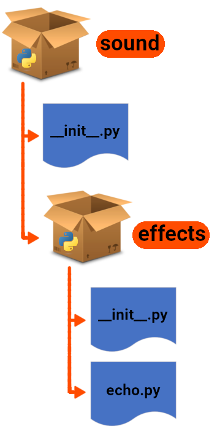

# Package

- A _package_ is a group of [python modules](./modules.md).
- A package can have many _subpackages_: a _subpackage_ is just another package within a bigger package, helping us to organize our code.
- Suppose you're developing a package to process audio files:

  1.  There are different audio files with different extensions.
  2.  Each extension needs to be processed differently.
  3.  You might find out tomorrow that there is this new extension which is gaining popularity.
  4.  You wanna provide different functionalities, e.g.:
      - Mixing.
      - Adding echo.
      - Applying an equalizer function.
      - Creating an artificial stereo effect.
      - Etc.
  5.  Possible structure for your package:

      

      - `sound` is the top-level package.
      - **`__init__.py`**:
        - Initialize the sound package or other subpackages.
        - It will be executed only once, in fact you've seen this behavior [here](./modules.md#caching-modules). It is the same idea but now you know that when you import a package or subpackage it will executes the `__init__.py` once.
        - Can just be an empty file.
        - It is mandatory by Python.
        - Mark a directory as a package/subpackage.

## Using the `Sound` Package

Clients of this package then can import it like this:

```py
import sound.effects.echo
```

Now to apply an echo effect we can say:

```py
sound.effects.echo.apply_effect(input, output, delay=0.7, atten=4)
```

Or you can simplify it a little bit by importing the `echo` module to use it directly:

```py
from sound.effects import echo
echo.apply_effect(input, output, delay=0.7, atten=4)
```

- `__all__`:

  - A list of submodules inside a package/subpackage, e.g.
    ```py
    __all__ = [
        "echo", # refers to sound/effects/echo.py
        # ...
    ]
    ```
  - Defined inside `__init__.py`.
  - Will be used by Python when importing `from sound.effects import *`.
    - **Reminder**: We do not use [this anti-pattern](./modules.md#antiPatternImport) though.
  - Note that if you have another object with the same name Python will pick that one. E.g.

    ```py
    __all__ = [
        "echo", # !!! refers to the 'echo' function now !!!
        # ...
    ]
    def echo(msg: str):  # <-- this name shadows the 'reverse.py' submodule
        return msg[::-1]
    ```

    **Reminder**, msg is using sequence [slicing feature](../02-getting-started/whetting-your-appetite-and-basic-concepts.md#operatorsSlicingString) of Python.

## Intra-package References

Suppose you need to import `sound/effect/echo.py` module inside the `sound/filters/vocoder.py`. We can do it either with:

1. **Absolute imports**:

   ```py
   # sound/filters/vocoder.py
   from sound.effects import echo
   ```

   Used mainly by the **main** module.

2. Or **relative imports**:

   ```py
   # sound/filters/vocoder.py
   from ..effect import echo
   ```

   Can be used in subpackages. But inside a subpackage we can actually use either absolute imports or relative ones.

## YouTube/Aparat

- [YouTube](https://youtu.be/QP1PlbkmaMk).
- [Aparat](https://aparat.com/v/ywf379c).

## Ref

- [Modules](https://docs.python.org/3/tutorial/modules.html).
