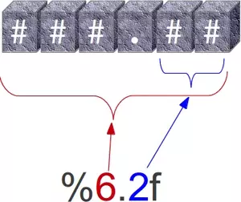
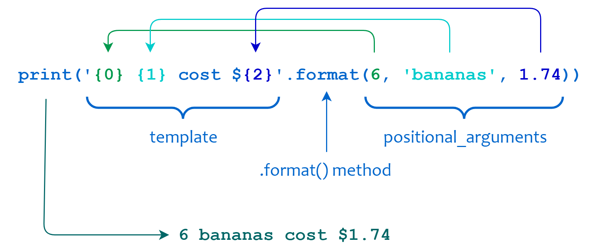
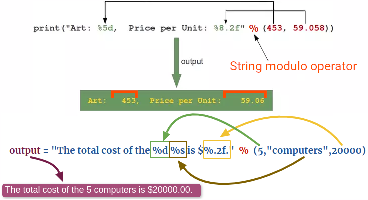

# String Formatting

Here we'll look at different means of modifying an string. You can have different motives to do it, maybe for the sake of printing something in the console or returning a human-readable response.

## [Formatted string literals](https://docs.python.org/3/reference/lexical_analysis.html#f-strings)

- AKA f-strings.

```py
 import math
 print(f'The value of pi is approximately {math.pi:.3f}.')
 profile = { "name": "Jan", "age": 123 }
 print(f"""
 Hi, I am {profile["name"]}.
 And I am {profile['age']} years old!
 """)
```



Passing an int after `:` specifies minimum number of characters wide.

- `!a` applies `ascii()`, `!s` applies `str()`, and `!r` applies `repr()`:

  ```py
  city_name = "München"
  print(f"City; {city_name}", F"City: {city_name!a}")
  ```

- To debug your app most of the times you need to log the variable name and its value:

  ```py
  var_name = 'something'
  print(f'Debugging {var_name=}')
  ```

## [`str.format()`](https://docs.python.org/3/library/string.html#formatstrings)

```py
dividend = 12_345
divisor = 1_234
percentage = dividend / divisor
result = '{:-8}\n÷{:-7}\n--------\n{:6.2%}'.format(
    dividend, divisor, percentage)
print(result)
# The brackets and characters within them are called format fields.
print('We are the {} who say "{}!"'.format('knights', 'Ni'))
print('{1} and {0}'.format('zero', 'one'))
print('The story of {0}, {1}, and {other}.'.format(
    'Bill', 'Manfred', other='Georg'))
table = {'Sjoerd': 4127, 'Jack': 4098, 'Dcab': 8637678}
print('Jack: {0[Jack]:d}; Sjoerd: {0[Sjoerd]:d}; '
      'Dcab: {0[Dcab]:d}'.format(table))
# The :d ensures that the values are treated and displayed as integers.
# If you remove it, the formatting system will automatically handle the type.
print('Jack: {Jack}; Sjoerd: {Sjoerd}; Dcab: {Dcab}'.format(**table))
# A trick which works in the same fashion as the previous line.
print(" "
      .join([f'{k}: {{{k}}} \n' for k in vars().keys()])
      .format(**vars()))
```



## Convert to String

- `repr()`: useful in OOP & for classes (more on that later when we reached to the classes).
  ```py
  # The repr() of a string adds string quotes and backslashes:
  hello = 'hello, world\n'
  hellos = repr(hello
  ```
- `str()`: Convert all data types to string.

## Manual Manipulation of Strings

```py
# Right-justify a string in a field of a given width by padding it with spaces on the left.
print("123456".rjust(12), "789")
# Same thing just the other way around.
print("ABCD".ljust(12), "EFGH")
# Centered.
print("Mohammad", "Jawad".center(12), "Barati")
print('12'.zfill(5))
print('-3.14'.zfill(7)) # Take the minus sign into account
```

## [String interpolation](https://docs.python.org/3/library/stdtypes.html#old-string-formatting)

```py
import math
print('The value of pi is approximately %5.3f.' % math.pi)
print('%s bought %d pairs of black socks.' % ('Jin', 2))
```


