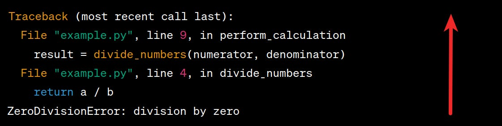

# Errors or Exceptions

- Syntactically correct.
- But still on execution you'll get an error.
- So **errors detected during execution** are called **exceptions**.
- Ain't unconditionally fatal, i.e. we can handle them in our Python programs.
- E.g. in a calculator your end-user might try to divide 1 by zero. And this is something you might wanna handle gracefully:
  ```py
  dividend = int(input("Enter dividend: "))
  divisor = int(input("Enter divisor: "))
  result = dividend / divisor
  print(f"dividend ÷ divisor = {result}")
  ```
  If you run this program and enter 15, and 5 it works just fine but what if you enter 15 and zero. Kaboom :boom:, it breaks:
  ```shell
  python calc.py
  Enter dividend: 12
  Enter divisor: 0
  Traceback (most recent call last):
    File "/home/kasir/projects/python/calc.py", line 3, in <module>
      result = dividend / divisor
               ~~~~~~~~~^~~~~~~~~
  ZeroDivisionError: division by zero
  ```
  Or if you try to enter a bogus value, instead of a valid number try to enter e.g. "abc".
  ```shell
  python calc.py
  Enter dividend: abc
  Traceback (most recent call last):
    File "/home/kasir/projects/python/calc.py", line 1, in <module>
      dividend = int(input("Enter dividend: "))
                 ^^^^^^^^^^^^^^^^^^^^^^^^^^^^^^
  ValueError: invalid literal for int() with base 10: 'abc'
  ```
- The last line of the error message indicates what happened.

## [Types of Exceptions](https://docs.python.org/3/library/exceptions.html#Exception)

- `ZeroDivisionError`, `NameError`, `TypeError`, ...
- The string printed as the exception type is the name of the **built-in exception** that occurred.
  - Not necessarily true for user defined ones.
    - You get to decide how you wanna log your error.
    - A good convention to have it.

### [`BaseException`](https://docs.python.org/3/library/exceptions.html#BaseException)

- Common base class of all exceptions.

### [`Exception`](https://docs.python.org/3/library/exceptions.html#Exception)

- A subclasses of `BaseException`.
- The base class of all the non-fatal exceptions.
  - This means exceptions which are not subclasses of `Exception` indicate that the program should terminate. E.g. `SystemExit`.
- Used as a wildcard that catches **almost** everything.
- Can add notes to an exception in order to add extra information to it:
  ```py
  exception = Exception("Some error")
  exception.add_note("Some note")
  exception.add_note("Some other note")
  raise exception
  ```
  This is particularly useful in `try ... except` statements where you might want to add extra information to an exception that you're handling in an `except` clause.

> [!TIP]
>
> Best practice: be as specific as possible with the types of exceptions that you intend to handle, and allow any **unexpected** exceptions to propagate.
>
> Though for debugging purposes we can use this class like this:
>
> ```py
> try:
>     pass
> except ValueError:
>     # ...
> except Exception as e:
>     print(f"Debugging, {e}")
> ```

## Stack Traceback



- Where the exception occurred.
- Called traceback since you get to see where the error occurred and who was calling that piece of code before it.

# YouTube/Aparat

- [https://youtu.be/GREIYOHGWEI](https://youtu.be/GREIYOHGWEI).
- [https://aparat.com/v/zqe0pcj](https://aparat.com/v/zqe0pcj).

## Ref

- [8. Errors and Exceptions](https://docs.python.org/3/tutorial/errors.html).
