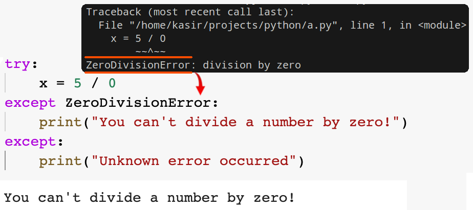
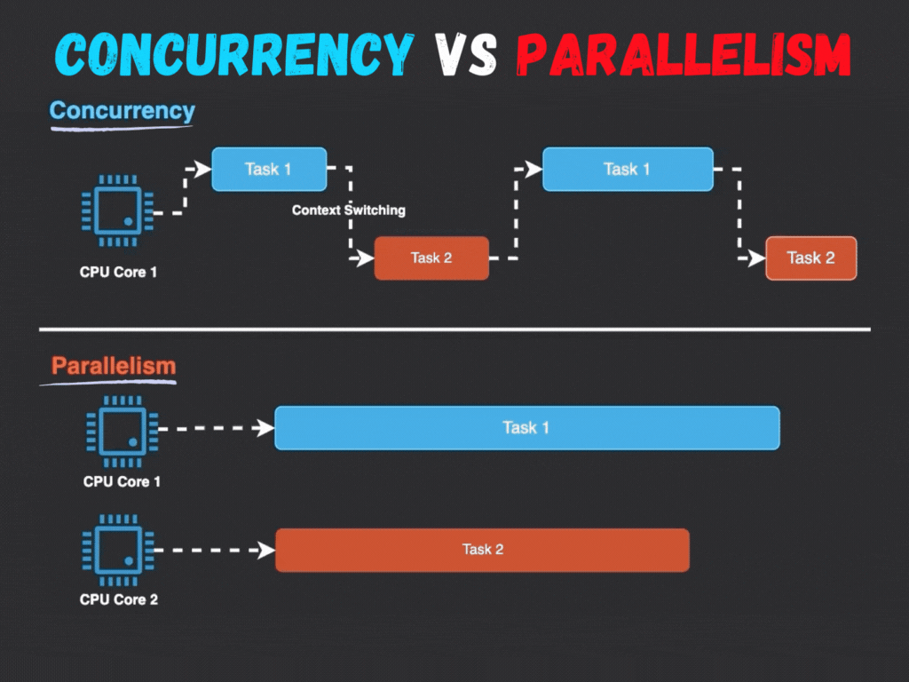

# `try ... except ... finally` Statement

- Handle selected exceptions.
- E.g. ask user for input until a valid integer has been entered:
  ```py
  while True:
      try:
          num1 = int(input("Please enter a number: "))
          break
      except ValueError:
          print("Oops!  That was no valid integer.  Try again...")
  ```
- We can access arguments of any exception by bounding the exception to a variable:
  ```py
  except Exception as e:
      print(e.args)
  ```
  Though usually you do not need to do this since if it is just for the sake of printing in python all of the built-in exceptions will log the `args` too (more on that when we talked about classes).
  <details>
    <summary>Just if you are really curious</summary>
    <p>
      In the built-in exception classes we have a method called <code>__str__()</code> which will be called by Python when it tries to convert a class object to a string. So inside that class Python is returning the <code>args</code> as a string.
    </p>
  </details>
- Or we can handle different cases:
  ```py
  try:
      # ...
      result = 1 / 0
  except ZeroDivisionError as e:
      print(e)
  except Exception as e:
      # Catches any kind of error
      print(e)
  finally:
      # Cleanup code
  ```
  Keep in mind that at most one of the `except` blocks will be executed.
- You can have multiple `try ... except` blocks inside one another:
  ```py
  def divide_numbers(numerator: int, denominator: int) -> float | None:
      try:
          return numerator / denominator
      except ValueError:
          print("Something wrong with values")
          return None # Note that we've caught the exception here, thus if python enters this block of code it will returns None.
  def get_int_number() -> int:
      while True:
          try:
              return int(input("Please enter a number: "))
          except ValueError:
              print("Oops!  That was no valid integer.  Try again...")
  def calc() -> None:
      numerator = get_int_number()
      nominator = get_int_number()
      try:
          result = divide_numbers(numerator, nominator)
          print(result)
      except Exception as e:
          print("Calc function's except block:")
          print(e)
  calc()
  ```
  Note that though it might be hard to see at first but what is really happening here is something like this:
  ```shell
  try:
      try:
          # ...
      except ValueError:
          # ...
  except Exception as e:
      # ...
  ```
- `except` blocks cannot catch each other's errors. if you wanna do that you need to do it manually:
  ```py
  try:
    pass
  except NameError as name_error:
      try:
          pass
      except Exception as any_error:
          pass
  ```
- You can also handle multiple exception in one `except` block:
  ```py
  except (RuntimeError, TypeError, NameError):
      pass
  ```

## [`try` Clause](https://docs.python.org/3/reference/compound_stmts.html#try).

- Inside the `try` block we write the code that might encounter some exceptions.
- Python runs this block of code first, or let's say tries to execute it.
- Possible scenarios:
  1. Nothing goes south Python runs all the codes in this block and jumps to `finally` block if present.
  2. An error, oh, now Python checks if we have defined an `except` block that matches the name of current exception. If it finds one it executes its block and then continues with the `finally` block.
  3. An error without a handler, thus Python tries to pass down the error to the outer `try ... except` block. If there is none, or we ain't handling it there either then it's an unhandled exception. This causes our Python program to crash and terminate with that error.

## [`except` Clause](https://docs.python.org/3/reference/executionmodel.html#exceptions).



- Breaking out of the normal flow of control of a code block.
- Handle errors or other exceptional conditions.
- An exception is raised.
- Python interpreter raises an exception when it detects a run-time error.
- Explicitly raise an exception with the `raise` statement.
- Cannot repair the cause of the error and retry the failing operation. But we can re-execute the function again if the exception was raised in a function for example.
- If the exception is not handled at all, the interpreter terminates execution of the program.

## [`finally` Clause](https://docs.python.org/3/reference/compound_stmts.html#finally).

- Optional.
- **Cleanup code** which does not handle the exception.
  - In Real world apps it is useful for releasing external resources (such as files or network connections).
- Executed whether:
  - An exception occurred or not in the preceding code.
  - You have used a `return`, `continue`, or `break` statement inside your `try` clause.
  - You've handled the exception gracefully or not.
  - You have a except clause for the raised exception or not. In this case it will executes the codes inside `finally` and then reraise the exception.
  - An exception was raised in your `except`/`else` clause or not. In the case of exception it will be reraised after it finishes executing the `finally` block.
- Here we can skip reraising errors by using a `return`, `continue`, or `break` statement.

> [!CAUTION]
>
> The `return` statement inside the `finally` takes precedence over the `return` statement inside the `try` clause!
>
> ```py
> def func():
>     try:
>         return 1
>     finally:
>         return 2
> print(func()) # 2
> ```

> [!TIP]
>
> There are some objects with a defined standard clean-up actions after object is no longer needed, regardless of whether or not the operation using the object succeeded or failed. E.g. [`with`](../06-files/README.md#with) statement is one of them.

## `else` Clause

- Optional.
- Defined after all `except` clauses.
- Code that must be executed if the `try` clause does not `raise` an exception.
- ```py
  try:
      print("some code...")
  except Exception:
      print("...")
  else:
      print("won't be executed if any exception was occurred inside the try clause")
  ```

## [`raise`](https://docs.python.org/3/reference/simple_stmts.html#raise)

- Allows the programmer to force a specified exception to occur.
  ```py
  raise Exception("Bad user input")
  ```
- It takes an optional argument.
  - This argument indicates the exception to be raised.
  - Should be an exception instance or an exception class. E.g. `BaseException`, or `Exception`, or classes who derive from them.
  - BTW we can delegate the task of instantiating an exception instance to the Python interpreter:
    ```py
    raise ValueError # Same as raise ValueError()
    ```
    But here we cannot pass any value to its `constructor`.
  - You can pass a string to it as its argument:
    ```py
    raise "SomeError"
    ```
- If no expressions are present, `raise` re-raises the exception that is currently being handled (AKA active exception). This is useful when you just wanna log something somewhere that this exception occurred:
  ```py
  try:
      result = 1 / 0
  except ZeroDivisionError as e:
      raise
  ```
- Called on its own with not active exception or an exception in front of it? a `RuntimeError` exception will be raised.
  ```py
  raise
  ```

### Exception Chaining

```py
try:
    open("somefile.txt")
except OSError:
    raise RuntimeError("unable to handle error")
```

- Here we will see the `Traceback` of both exceptions raised. One which is `FileNotFoundError`, raised by OS. And the `RuntimeError` which we've raised.
- Though you can also specify that an exception was a direct result of another exception with `from` clause. This is useful when we are handling multiple exception and are transforming them:
  ```py
  except (OSError, ConnectionError) as e:
      raise RuntimeError from e
  ```
- To disable this chaining behavior we can say:
  ```py
  except OSError:
      raise RuntimeError from None
  ```

## Dealing with Multiple Exceptions -- [`ExceptionGroup`](https://docs.python.org/3/library/exceptions.html#ExceptionGroup)

- Instead of raising the first exception we can collect all of them.
- Useful in concurrency and parallelism.

  

  

- Also good for where it is desirable to continue execution and collect multiple errors.

```py
def f():
    excs = [OSError('error 1'), SystemError('error 2')]
    raise ExceptionGroup('there were problems', excs)
try:
    f()
except* OSError as e:
    print("There were OSErrors")
except* SystemError as e:
    print("There were SystemErrors")
```

Note how we discerned the exception inside a group with `except*`. Though this is a contrived example but I guess this can give you a glimpse of what it would look like in a more realistic code:

```py
excs = []
for test in tests:
    try:
        test.run()
    except Exception as e:
        excs.append(e)
if excs:
   raise ExceptionGroup("Test Failures", excs)
```

Here for example we are running some tests and wanted to catch all the exceptions after we've executed all the tests and raise them all at once.

<details>
<summary>Why tests, and what are they?</summary>

Testing in software engineering is the process where you automate testing your code by writing code :grinning:. This is gives us:

- **Reproducibility**: you can simply rerun the offending test countless times to understand what is wrong.
- **Automation**: No need to manually test your app with every change.
- **Software quality**: It's much easier to write tests and then think of different cases.

</details>

## Ref

- [8. Errors and Exceptions](https://docs.python.org/3/tutorial/errors.html).
