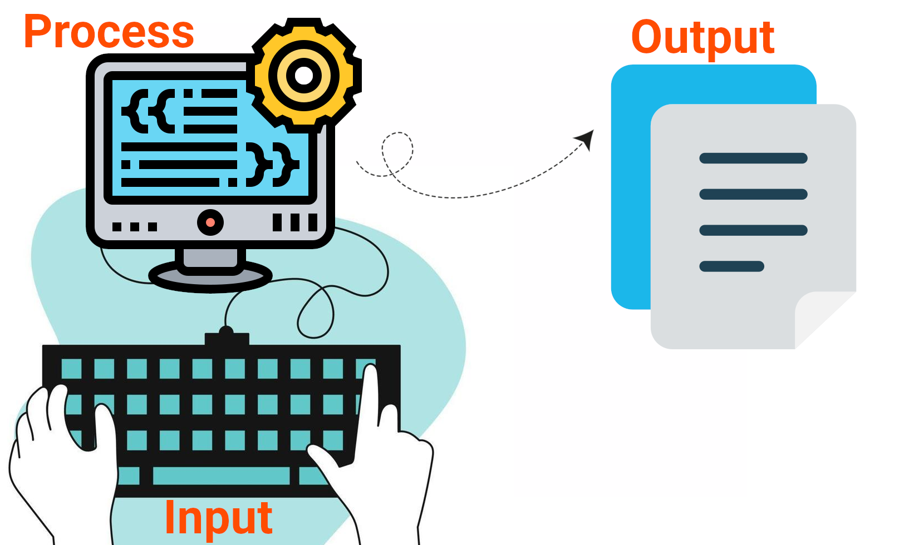
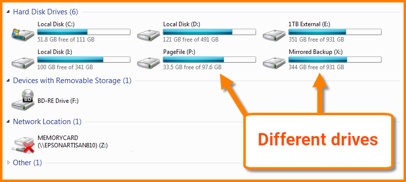
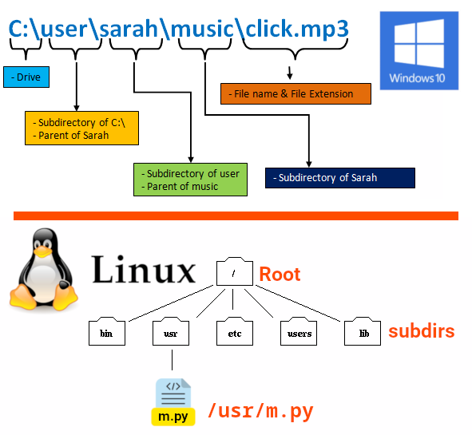
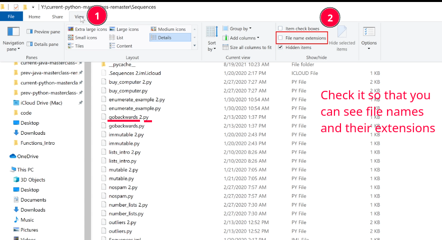
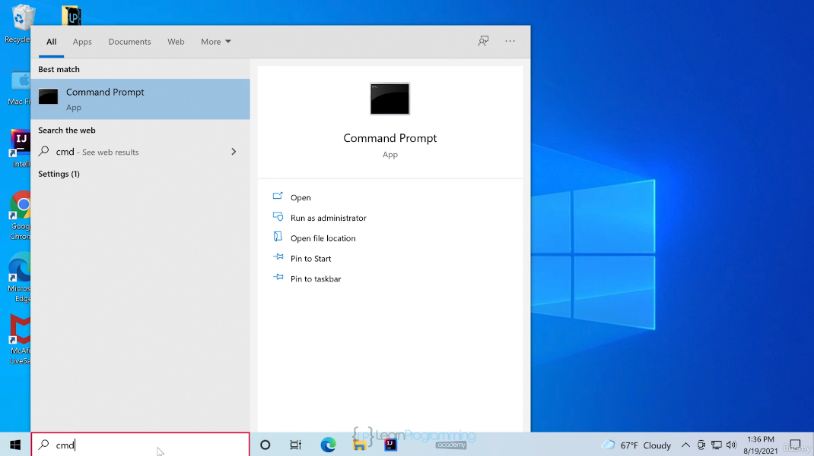

# Reading and Writing Files



- Here we'll store data in disk files.

## Files and Directories

- Files are the common storage unit in a computer, and all programs and data are "written" into a file and "read" from a file.
- We have directories/folders which are containers for files.
- **Linux** use **slash** to separate various parts of path.
- **Windows** uses **backslash** to separate various parts of path.
- In Linux you have everything inside root directory.
- In Windows you can have multiple drives which each will have their own root directory.

  - Like when we connect a USB stick to our computer.
  - Drive C is usually the default drive in Windows.
    - Why starting from C? because A and B are reserved letters for floppy disk drive and removable media ([ref](https://stackoverflow.com/a/531600/8784518)).

  



## Some Settings -- Windows Only



> [!CAUTION]
>
> Here I also have the "Hidden items" ticked. It is right below the "File name extensions".

> [!CAUTION]
>
> In Windows filenames are case-insensitive, i.e. `hello.py` is the same as `HeLLo.PY`. But this is **not** the case in Linux. So as a general guide treat filenames as case-sensitive.

## Terminal or Command Prompt



| Command Explanation               | Linux   | Windows |
| --------------------------------- | ------- | ------- |
| To clear your screen              | `clear` | `cls`   |
| Change drive                      | n/a.    | `d:`    |
| List all files inside a directory | `ls`    | `dir`   |
| Print current working directory   | `pwd`   | `cd`    |
| Change directory                  | `cd`    | `cd`    |

> [!NOTE]
>
> Learn it in Persian if youi like to learn more:
>
> - [آموزش کاربردی خط فرمان ویندوز CMD یا Command Prompt](https://www.aparat.com/v/k73nf1x/)
> - [دستورات خط فرمان مایکروسافت ویندوز | CMD - قسمت اول](https://www.aparat.com/v/t48ut5s/).

## Relative VS Absolute Path

|         | Relative                                                                                                                                                                             | Absolute                                                                                                                     |
| ------- | ------------------------------------------------------------------------------------------------------------------------------------------------------------------------------------ | ---------------------------------------------------------------------------------------------------------------------------- |
| Linux   | `../modules/cut.py`                                                                                                                                                                  | `/home/kasir/proj/modules/cut.py`                                                                                            |
| Windows | `..\modules\cut.py`                                                                                                                                                                  | `C:\Users\kasir\proj\modules\cut.py`                                                                                         |
|         | You're going there from where you are right now                                                                                                                                      | You'll get there no matter where you are in right now.                                                                       |
|         | E.g. you ask where is starbucks near me. And they'll say, take the next left, turn right at the school, and it's straight in front of you (works only relative to where you're now). | E.g. when we wanna open a website we need to provide the full address: `https://docs.python.org/3/tutorial/inputoutput.html` |

> [!TIP]
>
> - `.` points to the current directory.
> - `..` points to the directory above the current one.

## What is a Text File?

- A file with human-readable text inside it.
- You can open them in a text editor, e.g. Notepad, VSCode, etc.
- E.g. you can see something like this in an html file:
  ```html
  <html>
    <head>
      <title>Python Course</title>
    </head>
    <body>
      <h1>Python Course</h1>
      <p>Lorem ipsum...</p>
    </body>
  </html>
  ```
- Binary files: Hard to read (or not readable at all) and edit.

  ```cmd
  cat ./usr/share/qemu/linuxboot.bin
  ���f��f��f��f�f���f���g�l����f��f��f��f�f����f��f��f��f�f���f���g�l����f��f��f��f�f�Ǹ���f��f��f��f�f���f���g�lf�"��Ȏ��:���������QEMULinux loader
  ```

  This is just an example, and most of the times for opening this type of files you need special softwares, e.g. to edit a photo you need gimp or for editing audio files we need audacity.

- We can store info in a file:

  - In JSON format:
    ```json
    {
      "name": "Mohammad Jawad",
      "family": "Barati",
      "phoneNumber": "55551234"
    }
    ```
  - XML format:
    ```xml
    <person>
      <name>Mohammad Jawad</name>
      <family>Barati</family>
      <phoneNumber>55551234</phoneNumber>
    </person>
    ```
  - CSV format:

    ```csv
    Year,Make,Model
    1997,Ford,E350
    2000,Mercury,Cougar
    ```

    | Year | Make    | Model  |
    | ---- | ------- | ------ |
    | 1997 | Ford    | E350   |
    | 2000 | Mercury | Cougar |

  - Pickle files which is a python-specific way of serializing data.

## [`open(filename, mode='r', encoding=None)`](https://docs.python.org/3/library/functions.html#open)

Create a file called `message.txt` next to your project (type whatever you like inside it). And next to it create a python file with the following content:

```py
message_file = open('message.txt', 'r', encoding="utf-8")
for line in message_file:
    print(line)
message_file.close()
```

- Arguments:

  - First positional argument is the file name.
  - The second keyword argument specifies what we wanna do with the file, in other words the way in which the file will be used:

    - `'r'`: opens the file readonly. **Default value**.
    - `'w'`: write-only (an existing file with the same name will be erased).
    - `'a'`: opens the file for appending; any data written to the file is automatically added to the end.
    - `'r+'`: opens the file for both reading and writing.
    - `'b'`: opens the file in binary mode. Cannot read/write into it in the same way we used to do it.

    > [!CAUTION]
    >
    > When writing to a file in text mode by default Python converts platform-specific line endings (`\n` on Unix, `\r\n` on Windows) to just `\n`. But this might corrupt your binary file opened in binary mode (e.g. opening an image file om binary mode).

  - And the last keyword argument specify the encoding.

- Returns a file object.
  - File object:
    - AKA file-like objects or streams.
    - An object exposing a file-oriented API.
    - Mediates access to a real on-disk file.
- Treat the file object as a list (that's why we are looping over it).
- When you open a door we need to `close` it in the physical world, right? Same goes for files. After your opened them you need to close them too.

> [!NOTE]
>
> For reading lines from a file, you can loop over the file object. This is memory efficient, fast, and easier to read. Later you'll also be introduced to [`f.readline()`](#readlineMethod)

## [`with`](https://docs.python.org/3/reference/compound_stmts.html#with)

- [PEP 343](https://peps.python.org/pep-0343/) introduced `with` as a better way of working with files.
- File is properly closed after its suite finishes, even if an exception is raised at some point.
- The alternative is [`try ... except ... finally`](https://docs.python.org/3/reference/compound_stmts.html#try)
  ```py
  from typing import TextIO
  try:
      f: None | TextIO = None
      f = open('message.txt', 'r')
      f.read()
      # ...
  except Exception as e:
      print(f'Error occurred when opening/working with message.txt')
      print(f"{e=}")
  finally:
      if f is not None:
          f.close()
  ```
- We can use [`TextIO`](https://docs.python.org/3/library/typing.html#typing.TextIO) to type file objects opened in text mode.

```py
with open('message.txt', encoding="utf-8") as f:
    read_data = f.read()
    # ...
```

> [!CAUTION]
>
> Calling `f.write()` without using the `with` keyword or calling `f.close()` might fail to write everything to the disk, **even** if the program exits successfully.

> [!TIP]
>
> After a file object is closed, either by a `with` statement or by calling `f.close()`, attempts to use the file object will automatically fail:
>
> ```shell
> Traceback (most recent call last):
>   File "<stdin>", line 1, in <module>
> ValueError: I/O operation on closed file.
> ```

## [Methods of File Object](https://docs.python.org/3/library/io.html#i-o-base-classes)

- `f.read([size])`:
  - Reads a file's content.
  - Size indicates how much of the file should be read.
    - Omit it or pass a negative number for reading the entire file.
    - When reading the entire file make sure the file is not as huge as your memory or even larger than that. If that's the case do not blame Python for it.
- <a href="#readlineMethod" id="readlineMethod">#</a> `f.readline()`:
  - Reads a single line.
- `f.readlines()`:
  - Similar to `list(f)`.
  - Read all the lines of a file and returns a list.
- `f.write()`:
  - Writes to a file.
  - You need to convert other data types first to string or binary format before passing them to this method:
    ```py
    value = ('the answer', 42)
    s = str(value)  # convert the tuple to string
    f.write(s)
    ```
- `f.tell()`:

  ```py
  message_file = open('message.txt', 'r', encoding="utf-8")
  for _ in range(3):
      print(message_file.tell(), message_file.readline())
  message_file.close()
  ```

  - Returns an integer.
  - Current position in the file.

- `f.seek(offset, whence)`:
  - Changes where the position of file object is.
  - In **text** mode: you can only offset from the beginning of the file (`0`).
  - In **text** mode:
    - `message_file.seek(0, 0)` means the beginning of the file.
    - `message_file.seek(0, 1)` means the current position of the file (in other words it does not change anything, at least not for the text mode).
    - `message_file.seek(0, 2)` goes to the end of the file.

## Working with [JSON](https://www.json.org/json-en.html) files

- JSON: JavaScript Object Notation.
- Numbers take a bit more effort, since the `read()` method only returns strings, meaning you need to cast them explicitly to integer via `int()`, `float()`, etc.
- Need to store more complex data types like nested lists and dictionaries?
  - Parsing and serializing by hand becomes complicated, ugly and inefficient.
  - Thats where our savior comes into the scene, JSON format.
- Strings can easily be written to and read from a file.
- To work with it we have `json` module which is a built-in module in Python.

> [!TIP]
>
> The JSON format is commonly used by modern applications to allow for data exchange.

### Serialization & Deserialization

- Taking Python data types, and converting them to string representations is called **serializing**.
- Reconstructing the data from the string representation is called **deserializing**.

### Example of Working with JSON Files

1. Create a python file and use either `dumps` or `dump` code:

   <table>
   <tr><th><code>dumps</code></th><th><code>dump</code></th></tr>
   <tr>
   <td>

   ```python
   import json
   with open("user.json", "a+", encoding="utf-8") as json_file_object:
       serialized_user = json.dumps(
           {"username": "pythonic",
            "favorite_books": [{"name": "Narconomics"}],
            "groups": [],
            "age": "45",
            "gender": None})
       print(serialized_user)
       json_file_object.write(serialized_user)
   ```

   </td>

   <td>

   ```py
   import json
   with open("user.json", "a+", encoding="utf-8") as json_file_object:
       json.dump(
           {"username": "pythonic",
            "favorite_books": [{"name": "Narconomics"}],
            "groups": [],
            "age": "45",
            "gender": None}, json_file_object)
   ```

   </td>
   </tr>
   <table>

2. Open the JSON file and check what is being stored inside the gender. It is `null` and not `None`. That's a special type in JavaScript which is kinda equivalent to `None`.
3. Now you can read that same file again, delete all of your codes in that python file and instead write the following:

   ```py
   import json
   with open("user.json", "r", encoding="utf-8") as json_file_object:
       deserialized_user = json.load(json_file_object)
       print(deserialized_user)
       print(type(deserialized_user))
   ```

   And now you can see in your terminal that it prints `None` for gender. This is what I mean by serialization a deserialization.

> [!TIP]
>
> JSON files must be encoded in UTF-8, thus the reason behind using `encoding="utf-8"` when opening/creating the `user.json` file.

## Ref

- [7.2. Reading and Writing Files](https://docs.python.org/3/tutorial/inputoutput.html#reading-and-writing-files).
