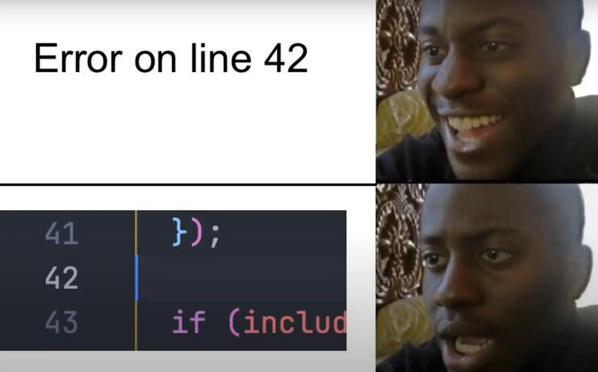

# Decorators in Python

- Decorators are frequently used in Python.
- They're typically functions that take another function as an argument and return a new function with added functionality.
- Attach pre- and post-processing operations to an existing function.
- In other words, they're a design pattern in Python that allows a user to add new functionality to an existing object without modifying its structure.
- We can apply multiple decorator to a single function, method, or data attribute.
  - You can learn about methods and data attributes [here](./introduction-to-classes.md).

## First Class Citizens

Functions in Python are [first class citizens](https://en.wikipedia.org/wiki/First-class_citizen), i.e. they support operations such as being passed as an argument, returned from a function, modified, and assigned to a variable.

```py
from typing import Callable
# Reassign this function to a new variable
def plus_one(number: int) -> int:
    return number + 1
add_one = plus_one
add_one(1)

# Define function inside another function
def func() -> None:
    def func2() -> None:
        pass

# Passing a function as an argument to another function
def perform_task(task_name: str, callback: Callable[[str], None]):
    print(f"Starting task: {task_name}...")
    print(f"Task ({task_name}) completed!")
    callback(task_name)
def notify_completion(task_name: str):
    print(f"Callback: {task_name} is complete!")
perform_task("Data Processing", notify_completion)

# Return a function
def outer_func():
    def return_me():
        pass
    return return_me
```

## Closures & Decorators

- Nested functions have access to the outer function variables as we've already touched it [here](../03-modularity/modules.md#scopes) when we talked about scopes and namespaces.
- A closure in Python is a function that remembers the environment in which it was created, even after that environment is no longer active. This means a nested function can use variables from its enclosing scope.
- Decorators rely on the ability of a nested wrapper function to access and modify the state of the enclosing decorator function.

```py
from typing import Callable
def greet_generator(name: str) -> Callable[[], None]:
    def greet():
        print(f"Hi dear {name}!")
    return greet
greet = greet_generator("Closure")
greet()
```

## Function-based Decorators

Here you can see that we are using all the previously mentioned features in one place:

- Closure.
- Functions are first class citizens.

```py
import datetime
from typing import Callable, Any
def logger(func: Callable[..., Any]) -> Callable[[], None]:
    """ Log when function execution started and when it ended. """
    def wrapper(*args: Any, **kwargs: Any):
        print(f"Before the function call: {datetime.datetime.now()}")
        print(args)
        print(kwargs)
        func()
        print(f"After the function call: {datetime.datetime.now()}")
    return wrapper
@logger
def greet():
    print("Hello!")
greet()
```

> [!NOTE]
>
> This is how you can define a general purpose decorator which will accept any number of arguments.

```py
from typing import Callable
def split(callback: Callable[..., str]) -> Callable[[], list[str]]:
    def wrapper():
        result = callback()
        return result.split()
    return wrapper
def uppercase(callback: Callable[..., str]) -> Callable[[], str]:
    def wrapper():
        result = callback()
        return result.upper()
    return wrapper

@split
@uppercase
def say_hi() -> str:
    return 'hi there'

print(say_hi())
```

> [!CAUTION]
>
> Order of decorators matter: in python decorators are executed bottom-up. Meaning if we revert the order of decorators here we'll get an error:
>
> ```py
> @uppercase
> @split
> def say_hi() -> str:
> ```

### Accessing Arguments Passed to The Function

From time to time we need to perform some sort of operation on the arguments of a function through decorators.

```py
from typing import Callable


def is_gmail(function: Callable[[str], None]) -> Callable[[str], None]:
    def wrapper(value: str):
        if value.endswith("@gmail.com"):
            function(value)
        else:
            raise Exception("It was not a Google mail address")
    return wrapper


@is_gmail
def send_notification(email: str) -> None:
    print("Sending notification to {}".format(email))


send_notification("")
```

### A Critical Issue With Decorators 🪲



- Decorators are wrappers around functions.
- The original function name, its docstring, and parameter list are all hidden by the wrapper closure.
- Try to log `__doc__`, or `__name__`:
  ```py
  print(send_notification.__name__)
  ```
- To solve this issue we can add `@functools.wraps` decorator:
  ```py
  import functools
  def uppercase_decorator(func):
      @functools.wraps(func)
      def wrapper():
          # ...
      return wrapper
  ```

## YouTube/Aparat

- [https://youtu.be/3BKs9D9kGaE](https://youtu.be/3BKs9D9kGaE).
- [https://aparat.com/v/sjg2n68](https://aparat.com/v/sjg2n68).

## Class-based Decorators

```py
from typing import Callable
class Uppercase:
    def __init__(self, function: Callable[..., str]) -> None:
        self.function = function
    def __call__(self, *args, **kwargs) -> str:
        result = self.function(*args, **kwargs)
        return result.upper()
@Uppercase
def greet() -> str:
    return "Huawei - Betelgeuse"
print(greet())
```

- A class with a `__call__` method that allows it to behave like a function.
- The `__init__` method initializes the decorator with the function to be decorated.
- The `__call__` method is invoked when the decorated function is called, allowing the decorator to modify its behavior.

### Why Class-based Decorators?

1. **Stateful**: use instance variables for greater flexibility.
   ```py
   from typing import Callable, Any
   class Counter:
       def __init__(self, function: Callable[..., Any]) -> None:
           self.function = function
           self.count = 0
       def __call__(self, *args, **kwargs) -> Callable[..., Any]:
           self.count += 1
           return self.function(*args, **kwargs)
   @Counter
   def f():
       pass
   f()
   f()
   f()
   ```
2. **Readability**: in a complex decorators, encapsulating logic in a class can make the code more organized and easier to understand.

## Another Perfect Real World Example

```py
from functools import lru_cache
@lru_cache(maxsize=128)
def fibonacci(n):
    if n < 2:
        return n
    return fibonacci(n - 1) + fibonacci(n - 2)
print(fibonacci(50))  # Subsequent calls with the same argument are much faster
print(fibonacci(100))
```

- **Logging**: Track function calls, arguments, and return values for debugging or auditing.
- **Authentication**: Enforce access control in web applications like Flask or Django.
- **Execution timing**: Measure and optimize function execution time for performance-critical tasks.
- **Retry mechanism**: Automatically retry failed function calls, useful in network operations.
- **Input validation**: Validate function arguments before execution.

## Ref

- [Python Decorators Tutorial](https://www.datacamp.com/tutorial/decorators-python).
