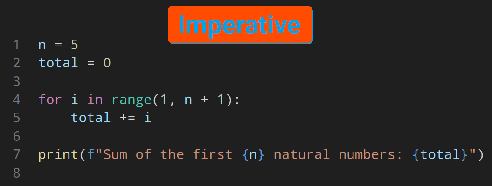
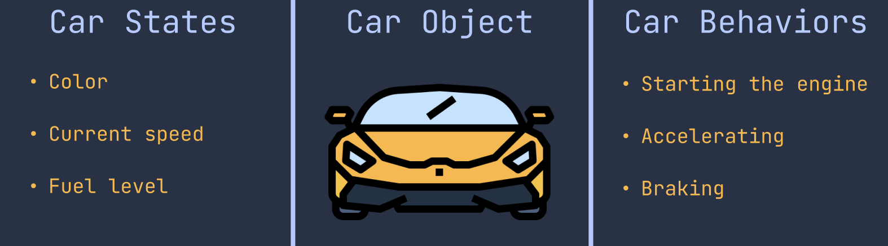
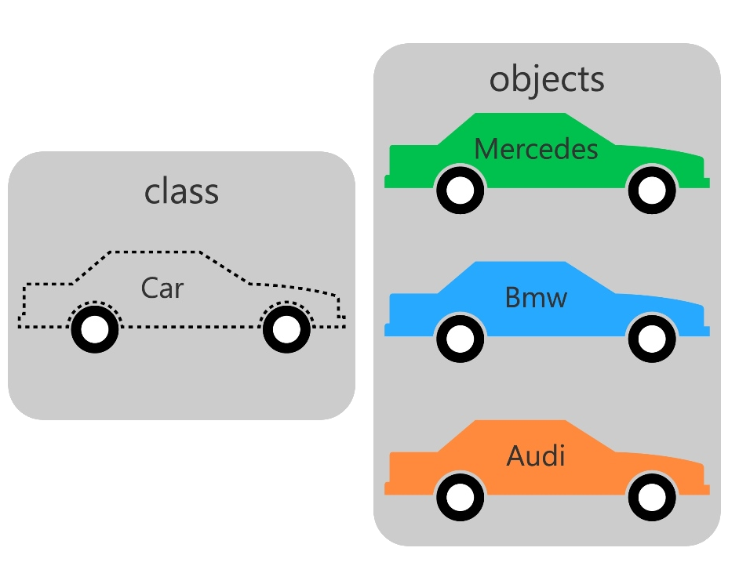
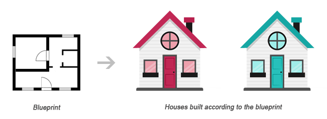

# Class

- Up until now I was trying to just use ["imperative style"](https://en.wikipedia.org/wiki/Imperative_programming) of programming.

  

  - Provide a series of instructions.
  - The computer follows them in an orderly fashion.

- Now let's talk about **O**bject **O**riented **P**rogramming.
  - OOP combines data and the processes that act on that data.
    - We refer to this usually as encapsulation, one of the four principles of OOP.
    - In other words bundling data and functionality together.
  - [We have touched it already when we began this course](../01-intro/README.md#oopPrinciple).

> [!NOTE]
>
> Different paradigms are not necessarily exclusive, in fact in OOP we use imperative programming within our methods to manipulate the data. And on the other hand you've already noticed that in Python we used a lot of OOP related concepts.

## OOP

Let's assume we are cooking:

- Utensils & ingredients:
  - The raw materials we need corresponds to the program data (state).
- Then we have the recipe:
  - Steps that must be performed to cook a delicious meal corresponds to **methods** defined for an object.
  - You know already [what is a function in Python](../02-getting-started/functions.md).
  - Roughly speaking a method is a function within a class.

Or another example of OOP would be cars:



- This pictures shows the OOP way of doing things.
- But if it was going to be imperative, to start the car we might have needed to follow these steps:

  1. Connect the 12V battery to your ignition system.
  2. Connect the fuel tank to the motor.
  3. Put the switch into ignition.
  4. Let the fuel to go into the motor.

- Whereas in the OOP style we only need to put the key into the ignition

  

> [!TIP]
>
> With OOP we are not removing all that complexity, we are just hiding it behind a user friendly API which them everybody can easy use.

### OOP in Python

- I guess I have not said it explicitly yet, but in Python everything is an object.
  ```py
  num1 = 10
  num2 = 20
  print(num1 + num2)
  print(num1.__add__(num2))
  ```
  These two different way of adding `num1` & `num2` will basically use the same code!
- We can start by trying to implement a `Car` class:

  ```py
  class Car:
      """ Create cars with model, and their color """

      def __init__(self, model: str, color="orangered"):
          self.model = model
          self.color = color
          self.start = False
  ```

  - The convention for naming classes in Python is to use [`PascalCase`](../01-intro/README.md#namingConventions) ([ref from PEP 8](https://peps.python.org/pep-0008/#class-names)).
  - Writing docstring is a good practice.
    - Here it might seems silly since you can tell by just glancing at it what this class does. But when your classes get more complicated you will see the light.
  - So now we can have multiple instances of it.
  - Each instance will have their own `model`, `color`, and `start`.

    

    - Instance: a fancy name for an object.
    - Instances share the same methods and attributes.
      - Attribute:
        - A variable bound to an instance of a class.
        - AKA properties, fields, data attributes.
        - Maintains a class's state.
      - Method:
        - Behaviors of a class.
        - Usually we use them to change the state of an object.

- Now let's create some cars:
  ```py
  mercedes = Car("Mercedes", "green")
  print(mercedes.color)
  print(mercedes.model)
  print(mercedes.start)
  ```
- BTW if you find this too much work you might consider using [`str.format`](../04-string-formatting/README.md#strformat):
  ```py
  print("{} {} {}".format(mercedes.model, mercedes.color, mercedes.start))
  print("{0.model} {0.color} {0.start}".format(mercedes))
  ```
  Here since `mercedes` is an object we can use their attributes in the string replacement fields.
- You can even change the value of a property:
  ```py
  mercedes.color = "black"
  ```
- Another analogy is blueprints, you can have blueprints and build based on theme, right?
  

> [!NOTE]
>
> BTW we have not forgot to talk about`__init__` method. We will cover that a little further down the line. So sit tight while we are learning some new stuff.

### A Short Summary of Jargons in OOP

- Class: A template for creating objects.
- Object: An **instance** of a class.
- Instantiate: The process of creating a new instance of a class.
- Method: A function defined inside a class.
- Attribute: A variable bound to an instance of a class.

> [!NOTE]
>
> These are oversimplified definitions of these jargons, but we have to walk you before you can run.

### Types in Python are Classes

- By types I mean, `int`, `str`, etc.
- You have noticed it already countless times that a type in Python is in fact a class.
- That's why we can call methods on them.
- This is different than other programming languages where we have types as primitive types and not classes.

### Defining a New Method

```py
class Car:
    def __init__(self, model: str, color: str):
        self.model = model
        self.color = color
        self.start = False

    def ignite(self):
        self.start = True


mercedes = Car("Mercedes", "green")
print(f"Is your car on: {mercedes.color}")
mercedes.ignite()
print(f"After igniting your car, its start state is {
      "on" if mercedes.start is True else "off"}")
```

- So the first thing we can see right away is the presence of `self` parameter. This is a good landmark to differentiate between methods and functions.
- `self` is just your somewhat ordinary argument.
- It can be named whatever you like but it should be there.
- According to [PEP 8](https://peps.python.org/pep-0008/#function-and-method-arguments) it should be the first argument always.
- It refers to the instance of the class.
- We do not need to pass a value to it, Python takes care of that for you automatically.
- Here as you can see we have changed the value of `start` inside the `ignite` method.

> [!CAUTION]
>
> Classes in Python are dynamic by nature. Meaning you can do something like this in your code:
>
> ```py
> mercedes.license_plate = "RAKL8136"
> print(mercedes.license_plate)
> ```
>
> But you should remember that:
>
> 1. This attribute will be added to the `mercedes` object only and e.g. if you have other objects they won't be having it.
> 2. Be careful when coding, with a simple typo you might experience runtime errors. So it is a good thing that we have intellisense in our VSCode and you should use it.

### Static Attributes

- They are methods/properties accessible through the class and not its instances.

#### Static Data Attributes

```py
class Car:
    has_engine = True

    def __init__(self):
        self.start = False

mercedes = Car()
print(mercedes.has_engine)
print(Car.has_engine)
print(mercedes.__dict__)
print(Car.__dict__)
```

- They are defined on the class itself.
- They are **not** part of the instances, but when python tries to resolve their value it will look it up in the class. You can try to changing the value of `has_engine` **through the class**.

  > [!CAUTION]
  >
  > Trying to change the `has_engine` through an object will result in adding that attribute to it. And will not have the same effect as `Car.has_engine = False`. Here we say that `has_engine` is shadowing the attribute defined in `Car` class.

#### Static Methods

```py
import uuid


class Profile:
    """ User profile """

    @staticmethod
    def _gen_id() -> str:
        return str(uuid.uuid4())

    def __init__(self, username: str) -> None:
        self.username = username
        self.id = Profile._gen_id()

    def whoami(self) -> str:
        return "{0.id}: {0.username}".format(self)
```

## Docstring for Classes

> [!NOTE]
>
> We have talked about docstring [here](../02-getting-started/better-dev-exp.md#docstring), read that part if you have forgotten what it was.

```py
class GitHubAccount:
    """
    User GitHub account profile info.

    Attributes:
      username: Username of their account
      avatar: User's GitHub avatar.
        By default our system uses it as user's avatar.
      linked_repos: A list of all linked repositories.
        This attribute is nullable.
    """

    @staticmethod
    def _get_avatar(username: str) -> str:
        """ Returns a direct link to the user's avatar. """
        # ...
        user_id = 123  # dummy value
        return f"https://avatars.githubusercontent.com/u/{user_id}?v=4&size=64"

    def __init__(self, username: str):
        self.username = username
        self.avatar = GitHubAccount._get_avatar(username)
        self.linked_repos = None
```

- Do not repeat yourself.
- Do not write docstring for the obvious.
- Pick a descriptive method name instead of a cryptic name.
- Write docstring when something might be ambiguous. E.g. here the returned string from `_get_avatar` might be interpreted as it will return the [file in Base64](https://en.wikipedia.org/wiki/Base64), or something else.

> [!TIP]
>
> You can see all the docstrings written for a class or a method by using the built-in `help` function:
>
> ```py
> help(User)
> help(User._get_avatar)
> help(User.__init__)
> ```
