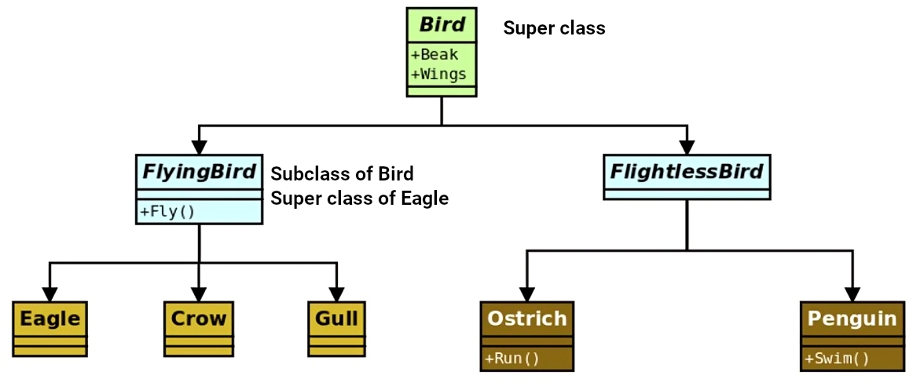
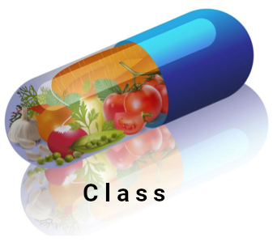
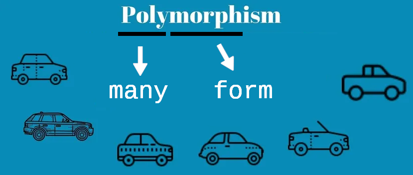
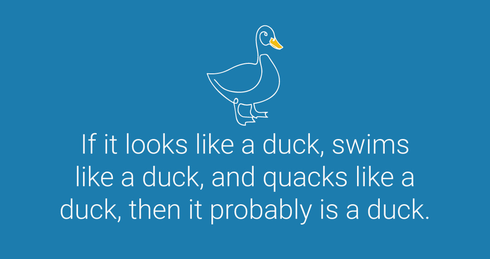
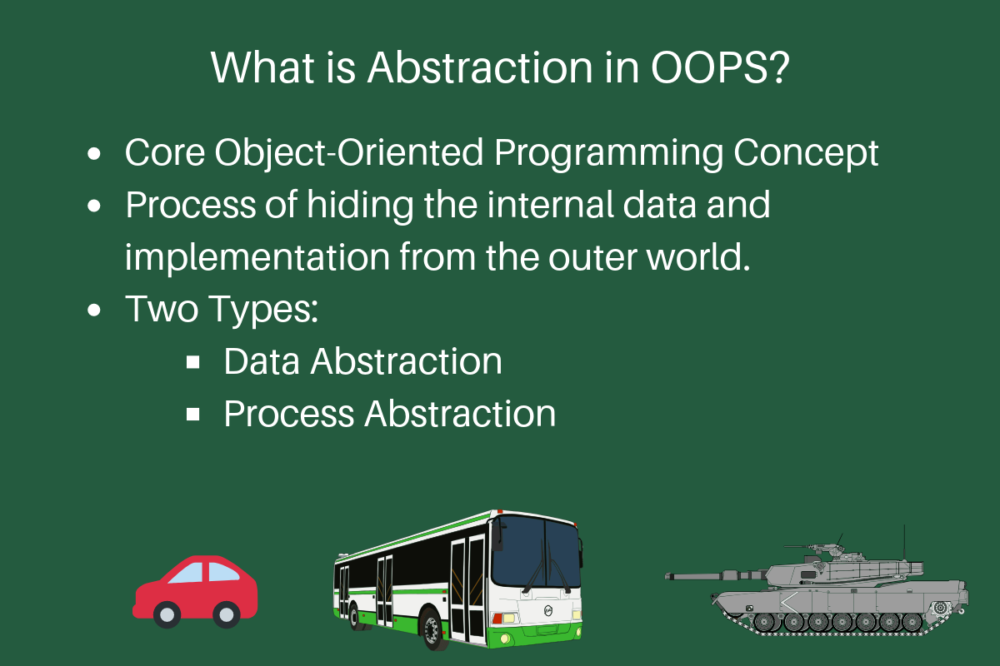

# Inheritance

- Different objects can have a certain amount of commonalities.

  - They inherit some features just because they fall into the same category.
  - E.g. an owl and penguin are both birds, so they both have wings and beak.

  

- Here is how the inheritance works in general:

  

  > [!NOTE]
  >
  > In Python we can have multiple inheritance, but it's not recommended, it has some pitfalls that you need to be really good and familiar with inheritance. Have you ever seen this kind of animal in nature?
  >
  > 

## Why do we need inheritance?

- We can reuse code ([DRY principle](https://www.getdbt.com/blog/guide-to-dry)).
- We can add new functionalities and extend the functionality of existing super class without modifying the super class ([open-close principle](https://en.wikipedia.org/wiki/Open%E2%80%93closed_principle#:~:text=In%20object%2Doriented%20programming%2C%20the,without%20modifying%20its%20source%20code.)).

```py
from typing import Literal


# Superclass: Bird
class Bird:
    def __init__(
            self, name: str,
            beak: Literal["short", "medium", "long"],
            wing_length: int) -> None:
        self.name = name
        self.beak = beak
        self.wing_length = wing_length

    def eat(self) -> str:
        return f"{self.name} is eating."


# Subclass: FlyingBird (inherits from Bird)
class FlyingBird(Bird):
    def fly(self) -> None:
        print(f"{self.name} is flying.")


# Subclass: Eagle (inherits from FlyingBird)
class Eagle(FlyingBird):
    def prey(self, prey_name: str) -> None:
        self.prey_name = prey_name
        print(f"{self.name} preys on a {prey_name}!")

    def eat(self) -> str:
        if not hasattr(self, 'prey_name'):
            return "No prey found. Cannot eat."

        msg = super().eat()
        msg += f" It's meal is a ${self.prey_name}"

        return msg


# Subclass: FlightlessBird (inherits from Bird)
class FlightlessBird(Bird):
    pass


# Subclass: Ostrich (inherits from FlightlessBird)
class Ostrich(FlightlessBird):
    def run(self) -> None:
        print(f"{self.name} runs!")


# Subclass: Penguin (inherits from FlightlessBird)
class Penguin(FlightlessBird):
    def swim(self) -> None:
        print(f"{self.name} swims!")


# Example usage
if __name__ == "__main__":
    eagle = Eagle("Bald Eagle", "medium", 100)
    ostrich = Ostrich("African Ostrich", "short", 50)
    penguin = Penguin("Emperor Penguin", "medium", 20)

    eagle.fly()
    eagle.prey("rabbit")
    print(eagle.eat())

    ostrich.run()
    print(ostrich.eat())

    penguin.swim()
    print(penguin.eat())
```

> [!NOTE]
>
> In Python 3 a class with no super class actually inherits from `object` class. In other words these two codes are equivalent:
> | Implicit inheritance | Explicit inheritance |
> | --- | --- |
> | <pre lang="python"><code>class MyClass:</code></pre> | <pre lang="python"><code>class MyClass(object):</code></pre> |

# Encapsulation



- Do not expose how something works.
- In other words, hide implementation details.
  - This enables us to change the implementation without the need to change our client code.
    - Client here would be the other modules who are importing our module and using it.
    - This also comes with its own conditions, you need to make sure that you're not changing the interface of your API.
- E.g. you need to uppercase all letters in a string, so we ain't interested in the actual implementation but rather just the result:
  ```py
  "mohammad".upper()
  ```
- In Python we can mark a method or attribute as non-public:

  - We can still access it, this is just convention for devs and between devs.
  - Add a single underscore ([ref](https://peps.python.org/pep-0008/#method-names-and-instance-variables)) to your method/attribute name.
  - But if you wanna have a mechanism to safeguard non-public attributes, or methods from accidental accesses you can utilize what is known as **mangling**.

    - A feature where the Python interpreter changes the names of non-public class properties in order to minimize the risk of them being accessed and overridden by mistake.
    - Python does this whenever our attribute/method starts with 2 underscores.
    - Note that inside the class we can still access it as we have defined it, but outside of the class it won't be accessible through the same name.

    ```py
    class User:
        """ Create a user and hash their password """

        @staticmethod
        def hash_password(password: str) -> str:
            # You can use libraries like argon2 to hash your password
            return password

        def __init__(self, name: str, password: str):
            self.name = name
            self.__password = User.hash_password(password)


    if __name__ == "__main__":
        jawad = User("Mohammad Jawad", "password")
        print(jawad.__dict__)
        jawad.__password = "something new"
        print(jawad.__dict__)
    ```

# Polymorphism



- Polymorphism is the ability to take many forms.

  ```py
  age = 30
  name = "Mohammad Jawad"
  favorite_food = "Pizza", "Ramen", "Kebab"
  print(age)
  print(name)
  print(favorite_food)
  ```

  The polymorphic behavior in this example is the ability to be printable. And this is all objects in Python implement a `__str__` method. And this method is inherited from the `object` class.

- With polymorphism we aim to delegate the behavior when we call a method to the object itself.

```py
class Penguin:

    def swim(self) -> None:
        print("Penguins can swim, so I am swimming.")

    def walk(self) -> None:
        print("Penguins can walk, so I am walking.")

class Duck:

    def swim(self) -> None:
        print("Ducks can swim, so I am swimming.")

    def walk(self) -> None:
        print("Ducks can walk, so I am walking.")

sea_land_birds = [Penguin(), Duck()]

for bird in sea_land_birds:
    bird.swim()
    bird.walk()
```



- This is known as the **Duck Test**. How it relates to polymorphism is that the `swim()` and `walk()` methods are the same for both the `Penguin` and `Duck` classes. So we can treat them as the same type. In other words, Python cares about what an object can do, not what's its type.
- [Duck test](https://en.wikipedia.org/wiki/Duck_test).

> [!TIP]
>
> To fix the mypy red squigiline error, You can use a structrual type hint called `Protocol`:
>
> ```py
> from typing import Protocol
> # ...
> class SeaLandBird(Protocol):
>     def swim(self) -> None: ...
>     def walk(self) -> None: ...
> # ...
> sea_land_birds: list[SeaLandBird] = [Penguin(), Duck()]
> ```
>
> This is a way to define type compatibility based on the structure (methods/attributes) of an object, rather than its explicit class hierarchy (nominal typing). And what we've done abow is what's know as ["duck typing"](https://en.wikipedia.org/wiki/Duck_typing).

# Abstraction



- **Abstract Method**: declared but contains no implementation. It is just a placeholder that tells the programmer that this method must be overridden by subclasses.
- **Abstract Class**:
  - It contains at least one abstract method.
  - You cannot create an instance of an abstract class directly.
- In Python, the `abc` module provides the necessary tools to implement abstraction classes.

```py
from abc import ABC, abstractmethod


class Animal(ABC):
    """ Abstract base class for animals """

    def __init__(self, name):
        self.name = name

    @abstractmethod
    def make_sound(self):
        """ Abstract method to making a sound based on the animal type """
        pass

    def sleep(self):
        print(f"{self.name} is sleeping")


class Dog(Animal):
    def make_sound(self):
        print(f"{self.name} says Woof!")


class Cat(Animal):
    def make_sound(self):
        print(f"{self.name} says Meow!")


if __name__ == "__main__":
    shepherd_dog = Dog("max")
    whiskers = Cat("Whiskers")

    shepherd_dog.make_sound()
    whiskers.make_sound()
    shepherd_dog.sleep()

    # This would raise an error since Animal is abstract
    # animal = Animal("Generic")
```

## YouTube/Aparat

- [https://youtu.be/-nbj0gF6TXQ](https://youtu.be/-nbj0gF6TXQ).
- [https://aparat.com/v/pjom106](https://aparat.com/v/pjom106).
