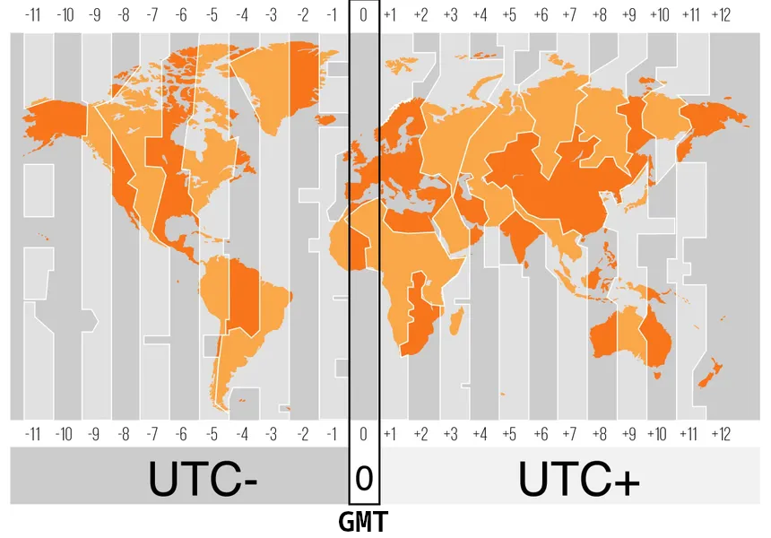

# Date & Time

Imagine you wanna build an app which enables its users to schedule virtual meetings. And your user base is gonna be international. So how you're gonna deal with topics such as different countries timezones, daylight saving time, etc.

Fortunately Python comes to rescue with its built-in datetime module :mechanical_arm:. But lets first learn about them a bit:

## Timezones

- The sun rises in the east. And if we travel to the east the sun will rise 1 hour earlier for every 15 degrees (of longitude) east you go from Greenwich and if you go west it will go down by 1 hour for every 15 degrees.

  

  As you can see most of the lines ain't straight. Timezones are decided based on political reasons and not geographical.

- Timezones help us to keep the daylight consistent across the planet.
- Timezones & daylight saving times is "interesting". For instance:

  - On 29.12.2011, Samoa switched sides of the international date line for the second time, losing December 30 in the process.

    - Samoa is a South Pacific nation that has jumped the international date line **for business reasons**.

      

    - And the reason that they could do it was that they are really close to the [international date line](https://en.wikipedia.org/wiki/International_Date_Line).
    - BTW they also lost 30th of December as a direct consequence of this jump!
    - Just google: "samoa timezone change story" to learn more.

## Jargons

<table>
<thead><tr><th>Jargon</th><th>Definition</th></tr></thead>
<tbody>
<tr>
  <td>Wall time</td>
  <td>AKA real-world time or wall-clock time, the actual time taken from the start of a computer program to the end.</td>
</tr>
<tr>
  <td>The Unix epoch</td>
  <td>The epoch is the reference point from which Unix time starts counting. Defined as midnight (00:00 UTC) on January 1, 1970 (<a href="https://stackoverflow.com/a/1090945/8784518">why this date?</a>).</td>
</tr>
<tr>
  <td>UTC</td>
  <td>Coordinated Universal Time. The primary <b>time standard</b> globally used to regulate clocks and time (<a href="https://www.timeanddate.com/time/utc-abbreviation.html" >Why UTC and not CUT?</a>). Times will be measured against UTC.</td>
</tr>
<tr>
  <td>GMT</td>
  <td>
  <ul>
    <li>Stands for Greenwich Mean Time.</li>
    <li>The local mean time at the Royal Observatory in Greenwich, London, counted from midnight. In simpler terms it is a timezone and no longer a time standard (it used to be a time standard though).</li>
  </td>
</tr>
<tr>
  <td>The IANA timezone database</td>
  <td>
    <ul>
      <li>AKA Olson database, tz database.</li>
      <li>Contains code & data representing the history of local time for many locations around the globe.</li>
      <li>Its publicly available and Linux updates its TZ database as part of regular updates it does.</li>
      <li>E.g. "Asia/Tokyo" which the first part is the name of ocean/continent, and the last part is the name of a major city.</li>
    </ul>
  </td>
</tr>
<tr>
  <td>DST</td>
  <td>
    Acronym of Daylight Saving Time. Time goes one hour:
    <ul>
      <li>Forward in spring.</li>
      <li>Back in autumn.</li>
    </ul>
  </td>
</tr>
</tbody>
</table>

> Fun fact:
>
> When I used the term interesting earlier, I did not meant as something which is fascinating, but I meant it as in the old curse:
>
> 
<a href="./assets/interesting-as-a-curse.png">"May you live in Interesting times"</a>

## Some 3rd-party Libs

- [pytz](https://pypi.org/project/pytz/).
- [dateutils](https://pypi.org/project/dateutils/).

> [!Note]
>
> If you're using Python version 3.9 or higher we probably do not need them since python supports timezone and a lot of other stuff out of the box in those versions.

> [!CAUTION]
>
> If you need to work with Persian, Chinese or other calendars the `datetime` module won't cut it.
