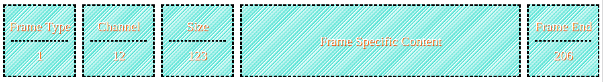

# Message Broker

- A postal service.
  - A service which gets our messages from A -> B.
- Producer:
  - Sender of the message.
  - The sender of the letter in postal service example.
- Consumers:
  - The party who receives the message.

## Async

- RabbitMQ works in async fashion.
  - Neither sender/receiver has to wait for the response.

## Exchange

- The brain of our RabbitMQ.
- Makes the decision on who should receives which message.
- Inner working of a postal service.
- Different exchange types offers different types of services.
- A producer always sends its messages to an exchange.
  - Exchange pushes the messages to one or more queues.
  - Messages will remain in the queue until it is consumed by a consumer.

## Queue

- Our letterbox.
- Consumer is responsible to consumes the messages.
- A message broker can have multiple queues.
- Queue declaration is an idempotent operation:
  - This means that we can define same queue as many times as we want to, but RabbitMQ will create it only once.

## (Exchange) N:M (Queue)

- We can have queue who ain't bound to any exchange.

## Connection

- Every producer/consumer should open a single TCP connection to our RabbitMQ broker.
- A connection can have multiple channel.
  - Our producer can send messages to our broker using different isolated channels without having to interfering with each other.
  - Channels our resource friendlier than opening new connections.

## AMQP

- Advanced Messaging Queuing Protocol.
- An open standard protocol for passing messages between apps.
- Implemented in Azure Server Bus, and RabbitMQ.
- Uses Remote Procedure Call.
  - Bidirectional.
- RabbitMQ uses commands to communicate between client (our python app) and RabbiMQ (broker).
  - Commands are classes, e.g. `channel` and `declare` is a method of `channel`.
  - All the data necessary for executing a command is in a data structure called frame.

### Frames

- Method frame:
- Content header frame:
- Body frame:
- Heartbeat frame:

## Different Patterns

- [Competing consumer pattern](./src/competing-consumer/README.md).
- [Pubsub pattern](./src/pubsub/README.md).
