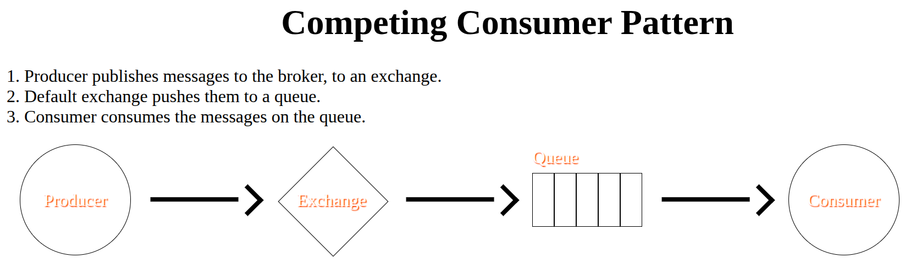

# Competing Consumer Pattern

- Common pattern.
- AKA work queue.
- Pass the work (resource intensive work) without having to wait for its completion (e.g. in a GraphQL API where we receive a request from the client we do not wanna wait for our AI model to process and produces something, but rather we need to start the process and then store it whenever it is done).



> [!TIP]
>
> It's possible to push too many messages to the queue (our consumers cannot keep up with the rate of messages produced by the producers). In this situation we might run out of memory since RabbitMQ stores those messages on memory. So we need to add a new consumer for that queue to keep up with messages. RabbitMQ distributes the messages in sequence, thus each consumer will get the same amount of messages as the other consumers. This distribution strategy is called **Round Robin**.

> [!CAUTION]
>
> The round robin distribution strategy works well in many scenarios but not always, especially if some of the consumers process the message quicker that others. This creates unbalanced message distribution. But we can tell RabbitMQ to not push a new message to a consumer as long as they have 1 message in process.
>
> ```py
> channel.basic_qos(1)
> ```
>
> And lastly we need to also prevent auto acknowledge where we consume:
>
> ```py
> channel.basic_consume(constants.REGISTERED_USER_QUEUE,
>                       handle_message,
>                       auto_ack=False)
> ```

# How to Start This Script

1. `cd docs/rabbitmq`.
2. `uv venv .venv`.
3. `source .venv/bin/activate`.
4. `uv install --requirements ./requirements.txt`.
5. Open multiple terminal and cd to the same path
   - Execute `python src/competing-consumer/consumer.py` in all of them to simulate having multiple consumers.
6. Start producing messages: `python src/competing-consumer/producer.py`.
