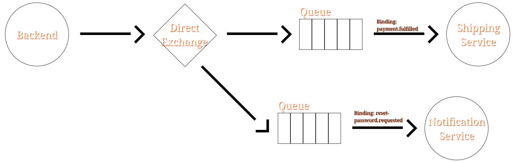
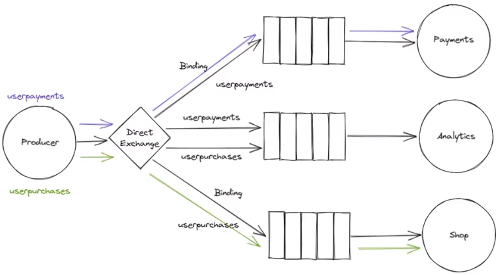
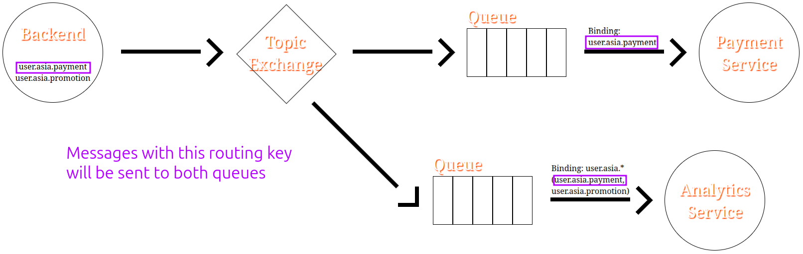

# Direct Exchange

- The default exchange.
- We need to send different messages to different queues.
- Uses routing keys to know where (which queue) a message should be routed to.

> Messages send with the `payment.fulfilled` will be only send to the _Shipping Service_. And messages with `rest-password.requested` will be only send to the _Notification Service_.

> [!TIP]
>
> A single queue can be bound to multiple routing key. Meaning, that queue will receive messages with either of those routing keys.
>
> 

# Topic Exchange

- Uses an arbitrary routing:
  - A list of words delimited by dots.
  - The words are meaningful.
  - `user.asia.payments`
  - We can use wild characters:
    - `user.asia*` sends all messages whom start with `user.asia` to Analytics Service.

