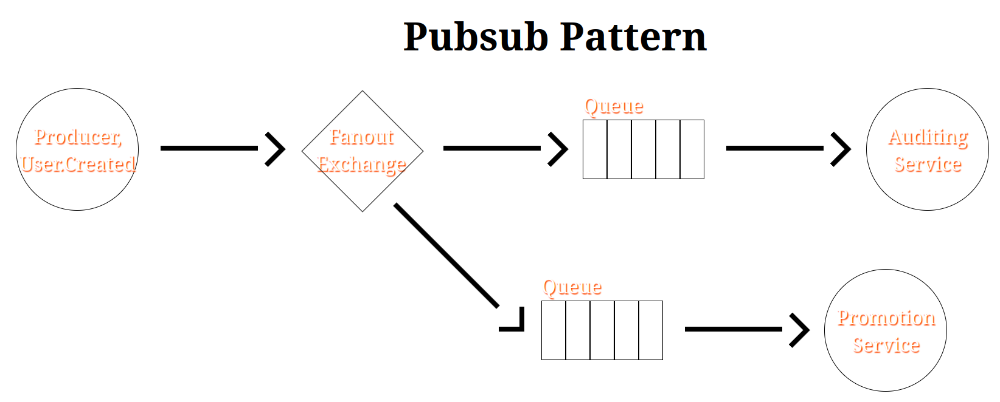

# Pubsub Pattern

- Sending same message to different consumers.
- User creates new account for themselves in our website, and we have an auditing service, and a promotion service which will send an email to the newcomers.
- Producer just wants to publish the message once and then we wanna broadcast the message.
  - To do this we need to use `fanout` exchange type.
- RabbitMQ will not duplicate the message, so no need to worry about memory footprint.



> [!TIP]
>
> You do not need to declare those queues upfront. We can use what's known as temporary queues which will be deleted automatically once the connection is closed:
>
> ```py
> queue = channel.queue_declare('', exclusive=True)
> ```

## How to Start This Example

1. `cd docs/rabbitmq`.
2. `uv venv .venv`.
3. `source .venv/bin/activate`.
4. `uv install --requirements ./requirements.txt`.
5. Open 3 terminal sessions and cd to the same path
6. Execute the following commands now:
   1. `python src/pubsub/auditing-service.py`.
   2. `python src/pubsub/promotion-service.py`.
   3. `python src/pubsub/producer.py`.
