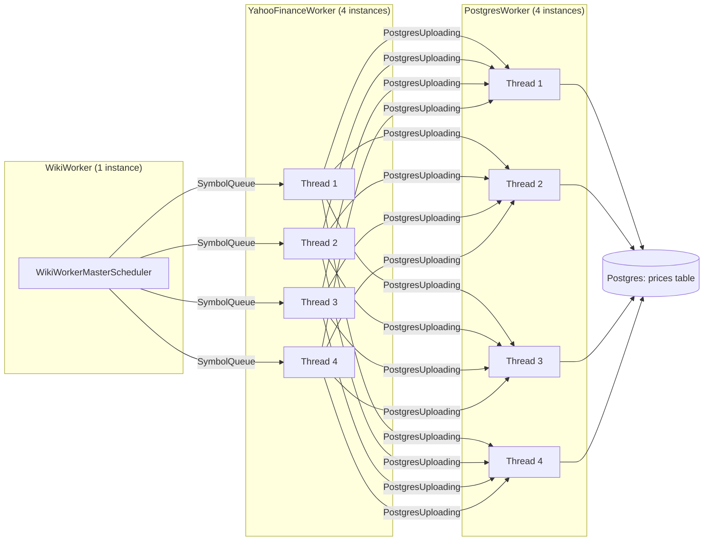
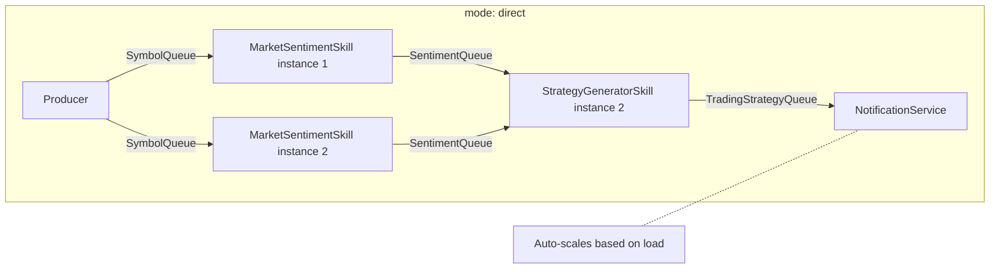
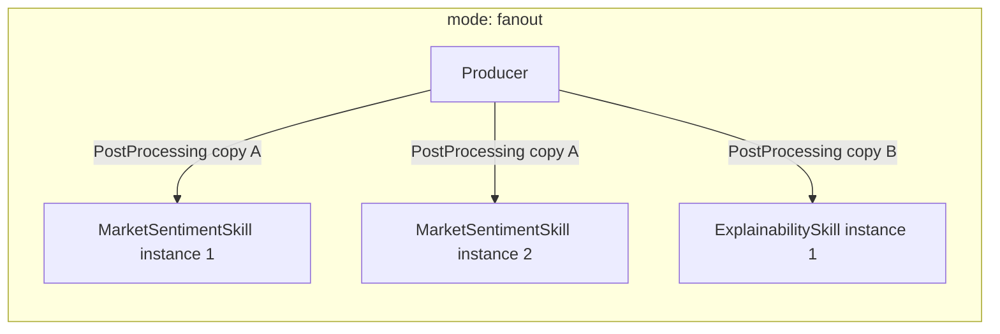
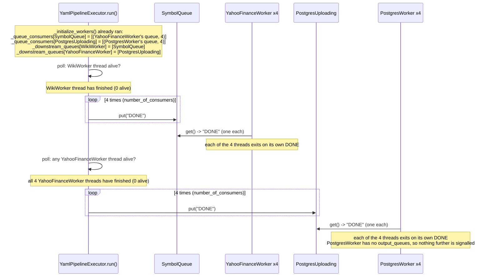

# Scraper Pipeline

A YAML-defined worker pipeline: `wiki.py` scrapes S&P 500 tickers, `yahoo_finance_price.py` fetches prices per ticker, `postgres.py` writes them to Postgres. `pipelines/reader.py` (`YamlPipelineExecutor`) reads `pipelines/wiki_yahoo_scraper_pipeline.yaml`, wires queues to workers, and drives shutdown.

## Topology



Each worker class is a `threading.Thread` that starts itself inside `__init__`. `YamlPipelineExecutor` is itself a `threading.Thread` (`reader.py`): its `run()` builds everything then polls worker liveness until the whole pipeline drains.

## Queue modes: direct vs. fanout

A queue in the `queues:` section takes an optional `mode`, defaulting to `direct`:

```yaml
queues:
  - name: SymbolQueue
    mode: direct    # default — one consuming stage, work split across its instances
  - name: PostProcessing
    mode: fanout     # every subscribing stage gets every item
```

- **`direct`** (default): a queue may be declared as `input_queue` by exactly one worker stage. That stage's *instances* still compete for items round-robin. Declaring the same `direct` queue as `input_queue` on a second stage is a load-time error — items would otherwise be silently split between the two stages instead of each getting the full stream.
- **`fanout`**: multiple stages may declare the same queue as `input_queue`. Under the hood `YamlPipelineExecutor` gives each subscribing stage its own physical queue and expands the producer's `output_queues` to write into all of them, so every subscriber sees every item; worker code is unchanged and stays unaware fan-out is even happening. Instances within one subscribing stage still compete over that stage's own copy.





In `direct` mode each item goes to exactly one stage instance, chosen by whichever instance happens to `get()` it first. In `fanout` mode every subscribing *stage* gets its own copy of every item; only the choice of *which instance within that stage* handles it is round-robin.

## Poison-pill (DONE) propagation

The hard part: a producer stage doesn't know how many consumer *threads* are reading its output queue, so it can't hardcode how many `"DONE"` sentinels to send. `YamlPipelineExecutor.run()` solves this centrally instead of leaving it to each worker file.



For every worker, on the tick where *all* of its instances are dead, `run()` looks up `_downstream_queues[worker]` and, for each downstream queue name, iterates every `(physical queue, instance count)` pair in `_queue_consumers[queue]` — one pair per subscribing stage — pushing that many copies of `"DONE"` into that stage's own queue. Each consumer (`YahooFinancePriceScheduler`, `PostgresMasterScheduler`) just exits on its own single `"DONE"`; it no longer forwards DONE itself. That decouples upstream/downstream instance counts, which the old per-worker-file approach didn't: it used to send one `"DONE"` per *queue* (not per consumer thread), so only 1 of N consumer threads got a real signal and the rest relied on falling through their 20s `queue.get(timeout=20)` `Empty` — not a hang, but not a clean shutdown either.

In `fanout` mode this same loop naturally scales: each subscribing stage has its own `(queue, instance count)` entry, so a stage with 2 instances gets 2 `"DONE"`s in its own queue and a stage with 1 instance gets 1, regardless of how many other stages are also fanned out to.
