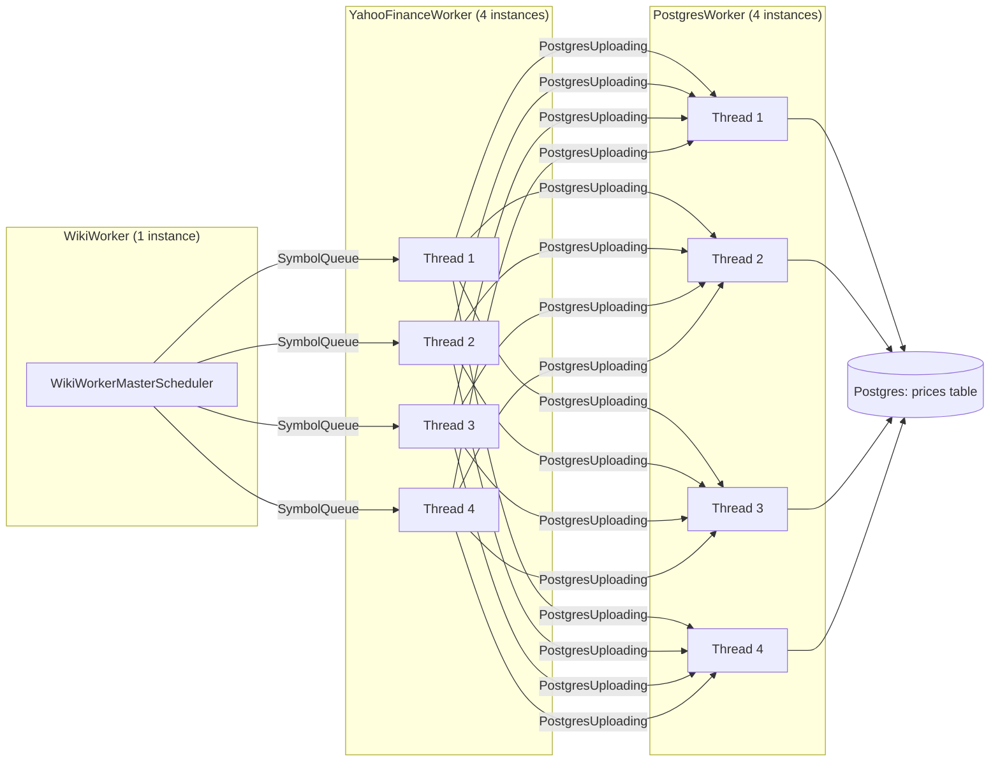
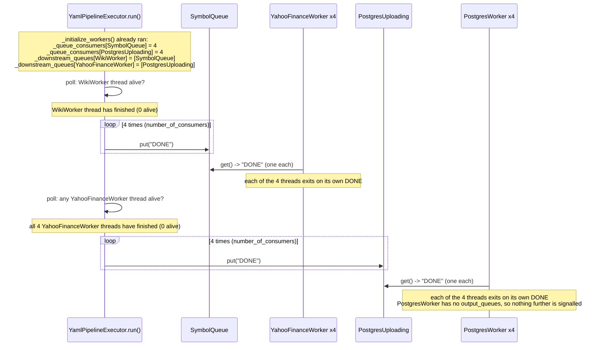

# Scraper Pipeline

A YAML-defined worker pipeline: `wiki.py` scrapes S&P 500 tickers, `yahoo_finance_price.py` fetches prices per ticker, `postgres.py` writes them to Postgres. `pipelines/reader.py` (`YamlPipelineExecutor`) reads `pipelines/wiki_yahoo_scraper_pipeline.yaml`, wires queues to workers, and drives shutdown.

## Topology

Each worker class is a `threading.Thread` that starts itself inside `__init__`. `YamlPipelineExecutor` is itself a `threading.Thread` (`reader.py`): its `run()` builds everything then polls worker liveness until the whole pipeline drains.

**Current limitation:** a queue can only be consumed by one worker stage. Queues fan work out across the *instances* of a single consuming worker (each item goes to exactly one instance), not across multiple different worker stages. A fanout/broadcast directive (send every item to all subscriber stages) vs. the current direct/round-robin behavior is a documented TODO in the YAML, not yet implemented.

## Poison-pill (DONE) propagation

The hard part: a producer stage doesn't know how many consumer *threads* are reading its output queue, so it can't hardcode how many `"DONE"` sentinels to send. `YamlPipelineExecutor.run()` solves this centrally instead of leaving it to each worker file.

For every worker, on the tick where *all* of its instances are dead, `run()` looks up `_downstream_queues[worker]` and, for each downstream queue, pushes `_queue_consumers[queue]` copies of `"DONE"` — exactly one per consumer thread. Each consumer (`YahooFinancePriceScheduler`, `PostgresMasterScheduler`) just exits on its own single `"DONE"`; it no longer forwards DONE itself. That decouples upstream/downstream instance counts, which the old per-worker-file approach didn't: it used to send one `"DONE"` per *queue* (not per consumer thread), so only 1 of N consumer threads got a real signal and the rest relied on falling through their 20s `queue.get(timeout=20)` `Empty` — not a hang, but not a clean shutdown either.
