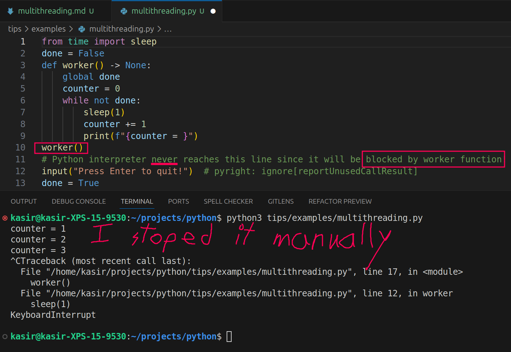
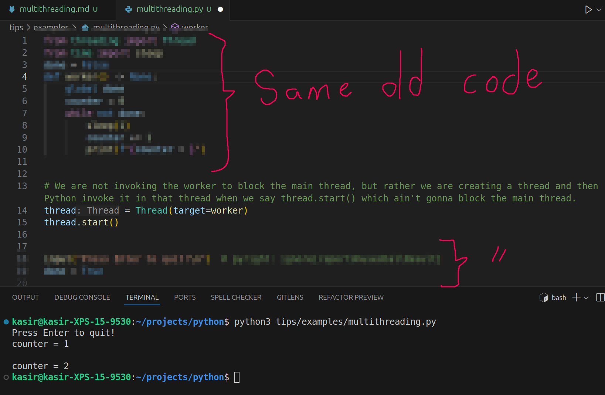

# Multithreading

- Perform multiple tasks at the same time.
- It is good for when you wanna perform I/O tasks, e.g.:
  - Make HTTP calls.
  - Store something in DB.
- Without multithreading you cannot have these kind of codes:



But if you use the `Thread` class you can run function in a separate thread.

> [!CAUTION]
>
> `Thread` class used down below does not allow for actual parallelism. But if you want real parallelism you need to use [`multiprocessing`](./multiprocessing.md).



> [!CAUTION]
>
> Here if we change the loop to `while True`, even if you hit enter it wont quit. The reason is simple, main thread has nothing else to run, but the other thread is still executing the `worker` function.
>
> **Though you can tell Python interpreter that a thread should be closed ASAP the main thread was closed**:
>
> ```py
> # ...
> thread = Thread(target=worker, daemon=True)
> # ...
> ```

## Passing Arguments to the Function

- `args` accepts a tuple.

```py
def worker(some_arg: str):
    print(some_arg)
Thread(target=worker, args=("abc",))
```

> [!TIP]
>
> If you need to wait for the threads to finish their tasks and after that you wanna continue you need to use the `thread.join()` method.

- [Example](./examples/multithreading.py).
