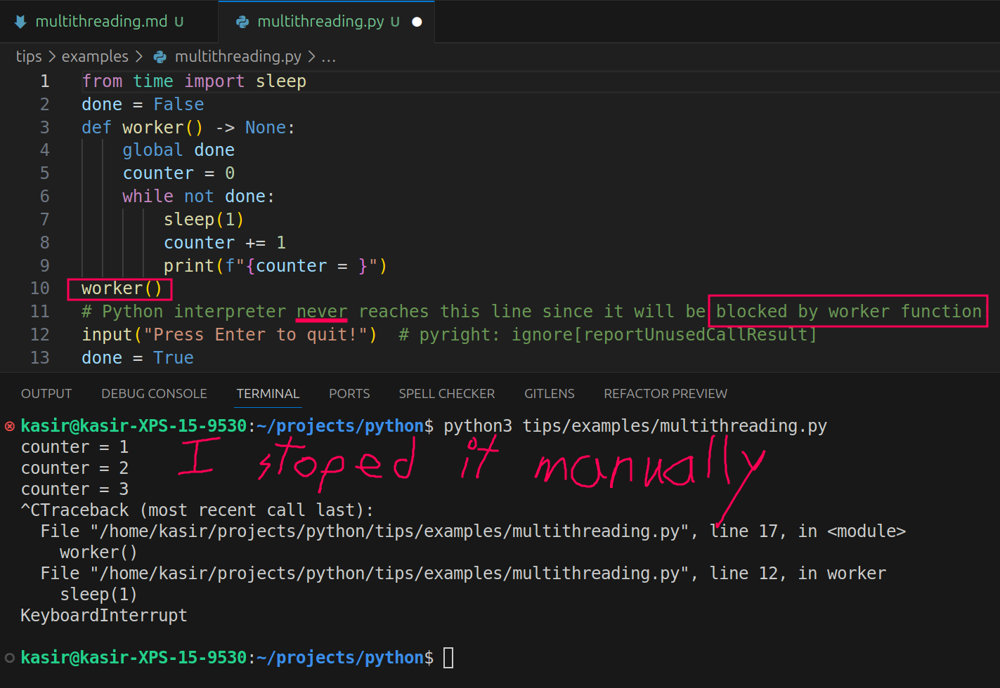
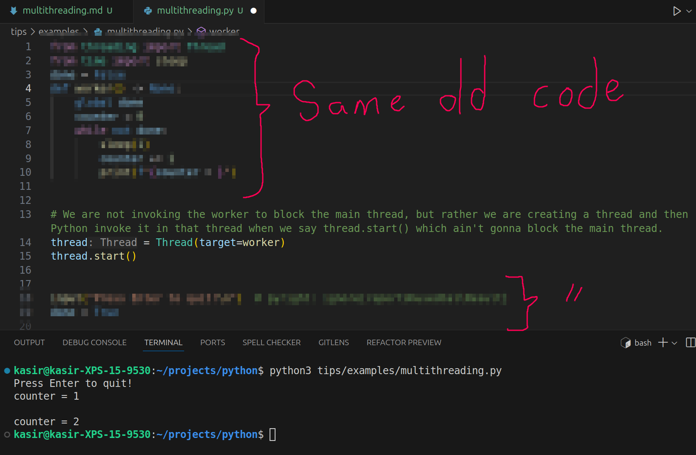

# Multithreading

- Perform multiple tasks at the same time.
- It is good for when you wanna perform I/O tasks, e.g.:
  - Make HTTP calls.
  - Store something in DB.
- Keep in mind multithreading is all good and well but they will complicate your code and make debugging harder.
- Without multithreading you cannot have these kind of codes:



But if you use the `Thread` class you can run function in a separate thread.

> [!CAUTION]
>
> We have Global Interpreter Lock (GIL for short) which allows only a single thread to be running at a time. But nonetheless it is way better than having everything in a single thread. This is not an issue generally with [`multiprocessing`](./multiprocessing.md) and `asyncio` since the former is an entire separate process with its own GIL and the latter is just simply a completely different paradigm. So in short `Thread` class used down below does **NOT** allow for actual parallelism.



> [!CAUTION]
>
> Here if we change the loop to `while True`, even if you hit enter it wont quit. The reason is simple, main thread has nothing else to run, but the other thread is still executing the `worker` function.
>
> **Though you can tell Python interpreter that a thread should be closed ASAP, the main thread closes**. Imagine you have a FastAPI/Flask/Django or any other frameworks you can use to develop a RESTful/GraphQL/gRPC API. You might have some RabbitMQ messages your API needs to consume and you do **NOT** wanna create a separate worker for it. Then you can just try to have a thread running in the background which consumes the incoming messages:
>
> ```py
> # ...
> thread = Thread(target=rabbitmq_consumer, daemon=True)
> # ...
> ```
>
> Keep in mind `daemon=True` alone is not the full production-grade solution:
>
> - **No graceful shutdown.** A daemon thread is killed abruptly the moment the main thread exits, even mid-message. If you hadn't ack'd yet, RabbitMQ will redeliver it (fine if your processing is idempotent), but any partial side effect (e.g. a half-finished DB write) can leave inconsistent state. Mature setups usually register `SIGTERM`/`SIGINT` handlers that call `channel.stop_consuming()` and `thread.join(timeout=...)` to drain cleanly before the process dies, instead of relying on the daemon flag to just yank the thread.
> - **No crash recovery.** If the consumer thread raises an unhandled exception, it dies silently, your API keeps serving HTTP requests, but message consumption has quietly stopped. You'd want reconnect/retry logic around the consume loop (e.g. `pika`'s connection recovery) plus logging/alerting.
> - **At scale, prefer a separate process.** A thread-in-API-process consumer is a fine lightweight/dev-scale pattern, but once message correctness and throughput matter, most teams run the consumer as its own worker process/deployment (e.g. Celery, or a standalone `worker.py`) instead of sharing the API process's lifecycle.
>
> [Example](./examples/strawberry-rabbitmq-consumer.py) with a Strawberry GraphQL API: a daemon thread consumes RabbitMQ, and `SIGTERM`/`SIGINT` handlers do the graceful `stop()`/`join()` this note talks about.
>
> [Example](./examples/rabbitmq-worker-service/) of the "separate process" bullet above: the same consumer pulled out into its own `worker/` service, with the API left only talking to Redis pub/sub, plus a docker-compose stack and pytest/testcontainers integration tests proving a worker crash never loses a message.

## Passing Arguments to the Function

- `args` accepts a tuple.

```py
def worker(some_arg: str):
    print(some_arg)
Thread(target=worker, args=("abc",))
```

> [!TIP]
>
> If you need to wait for the threads to finish their tasks and after that you wanna continue you need to use the `thread.join()` method.

- [Example](./examples/multithreading.py).

## The Pipeline Design Pattern

So I have implemented a complete pipeline using threads in python and honestly it looks fantastic. You can find the post I wrote about it here: https://dev.to/kasir-barati/the-pipeline-pattern-15j5

And [this example](./examples/scrapper-pipeline-design-pattern/) is pushing it to the next level.
